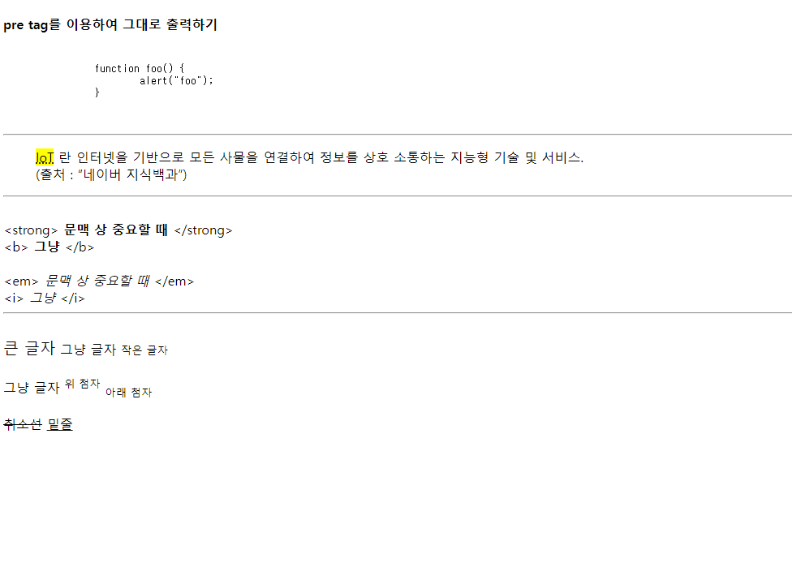

# HTML Text Formatting

## Text Formatting

- 종류

  

    - Formatting 요소에는 화면에 동일하게 출력되지만 의미가 다른 것이 있다.
        - <b>, <strong> 의 경우 출력되는 결과는 볼드 처리로 동일하지만, 문맥 상의 강조를 원할 때 <strong> 태그를 쓴다.
        - <i>, <em> 의 경우도 이탤릭 처리로 동일한 결과를 볼 수 있지만, 문맥 상 의미가 있을 경우엔 <em> 태그를 쓴다.
        ```html
        <a href="https://2weeks0.tistory.com/">a 태그</a>
        ```

    - 어느 태그에나 들어갈 수 있는 공용 태그가 있다.
        1. class: tag에 적용할 스타일 클래스를 지정
        2. dir: 텍스트 방향 지정 (ltr, rtl)
        3. id: 유일한 id 지정 (주로 자바스크립트에서 id를 통해 태그를 참조함)
        4. style: 인라인 스타일 적용
        5. title: 추가 정보 지정. tag에 마우스 포인터를 위치시킬 때, 해당 title이 뜸.

- head 태그의 요소
    - html 문서의 정보를 전달하는 역할
    - title, meta, style, script, link 태그 포함 가능
- body 태그의 요소
    - Web Browser에 보여질 문서 내용을 작성하는 곳!
    - head 태그 하단에 위치함
    
    ```html
    <!DOCTYPE html>
    <html lang="en">
      <head>
        <meta charset="UTF-8" />
        <meta http-equiv="X-UA-Compatible" content="IE=edge" />
        <meta name="viewport" content="width=device-width, initial-scale=1.0" />
        <title>Document</title>
      </head>
      <body>
        <h4>pre tag를 이용하여 그대로 출력하기</h4>
        <pre>
            <code>
            function foo() {
                alert("foo");
            }
            </code>
        </pre>
        <hr>
        <blockquote>
          <abbr title="Internet of Things"><mark>IoT</mark></abbr>
          란 인터넷을 기반으로 모든 사물을 연결하여 정보를 상호 소통하는 지능형 기술 및 서비스.
          <br />
          (출처 :
          <q cite="https://terms.naver.com/alikeMeaning.nhn?query=E00273180">네이버 지식백과</q>)
        </blockquote>
        <hr>
        <br>
        &lt;strong&gt; <strong>문맥 상 중요할 때</strong> &lt;/strong&gt;
        <br>
        &lt;b&gt; <b>그냥</b> &lt;/b&gt;
        <br>
        <br>
        &lt;em&gt; <em>문맥 상 중요할 때</em> &lt;/em&gt;
        <br>
        &lt;i&gt; <i>그냥</i> &lt;/i&gt;
        <hr>
        <br>
        <big>큰 글자</big>
        그냥 글자
        <small>작은 글자</small>
        <br>
        <br>
        그냥 글자
        <sup>위 첨자</sup>
        <sub>아래 첨자</sub>
        <br>
        <br>
        <s>취소선</s>
        <u>밑줄</u>
      </body>
    </html>
    ```
  