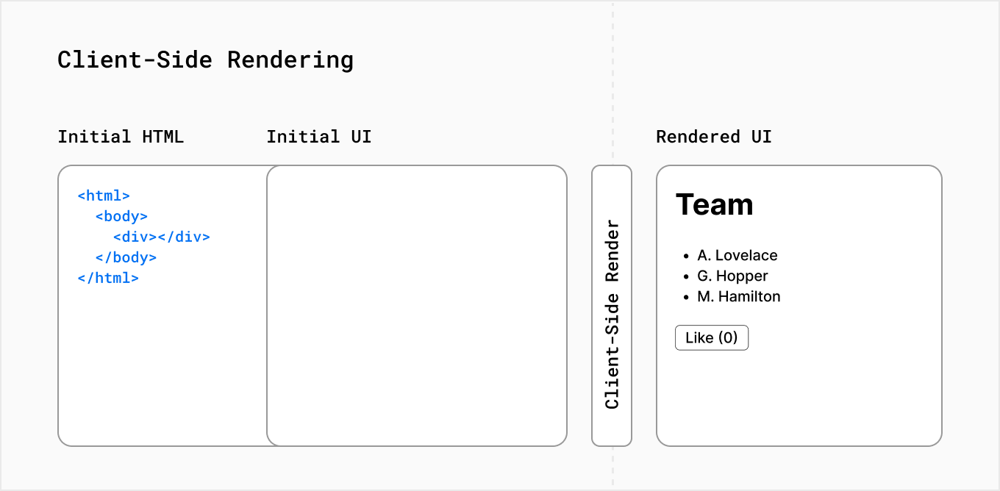

# [Next.js] 개요

Next.js란 서버 사이드 렌더링을 위한 React 프레임워크다.  Next.js에서 제공하는 기능은 아래와 같다.

1. 다이나믹 라우트를 지원
2. 각 페이지마다 기본적인 사전 렌더링, SSG(static generation), SSR(server-side rendering) 지원
3. 최적화된 프리펫칭을 이용한 CSR(client-side rendering)
4. Built-in css, sass 지원
5. 개발 환경에서의 핫 리로드, 리프레시 지원
6. serverless 환경에서 API를 구축하기 위한 API 라우트 지원

## Next.js에서 지원하는 렌더링

Next.js의 장점은 SSG, SSR 또는 CSR 여부에 관계없이 페이지 별로 사용 ​​사례에 가장 적합한 렌더링 방법을 선택할 수 있다는 것이다.

### CSR

표준 React 애플리케이션에서 브라우저는 UI를 구성하기 위한 JavaScript과 함께 서버로부터 빈 HTML을 받는다. 초기 렌더링 작업이 클라이언트에서 발생하기 때문에 이를 클라이언트 사이드 렌더링 이라고 한다.

> 참고: useEffect() 과 같은 훅으로 데이터를 가져오도록 선택하여 Next.js 애플리케이션의 특정 구성 요소에 대해 클라이언트 사이드 렌더링을 사용하도록 선택할 수 있다.

### pre-rendering

 Next.js는 기본적으로 모든 페이지를 미리 렌더링한다. 사전 렌더링은 HTML이 클라이언트의 JavaScript로 모두 수행되는 대신 서버에서 미리 생성됨을 의미한다.

CSR 앱의 경우 렌더링 작업이 완료되는 동안 사용자에게 빈 페이지가 표시된다.

### pre-rendering - SSR

SSR을 사용하면 페이지의 HTML이 각 요청에 대해 서버에서 생성된다. 그런 다음 페이지를 만들기 위해 생성된 HTML, JSON 데이터 및 JavaScript가 클라이언트로 전송된다.

클라이언트에서 HTML은 페이지를 표시하는 데 사용되는 반면 React는 JSON 데이터와 JavaScript 명령을 사용하여 구성 요소를 만든다(예: 버튼에 이벤트 핸들러 연결). 이 과정을 hydration이라고 합니다 .

`getServerSideProps`를 사용하여 SSR 페이지를 선택할 수 있다.

### pre-rendering - SSG

SSG를 사용하면 HTML이 서버에서 생성되지만 SSR과 달리 런타임 때 서버가 없다. 대신 애플리케이션이 배포될 때 빌드 시 콘텐츠가 한 번 생성되고 HTML이 CDN 에 저장되고 각 요청에 대해 재사용된다.

`getStaticProps`를 사용하여 페이지를 정적으로 생성하도록 선택할 수 있다.
