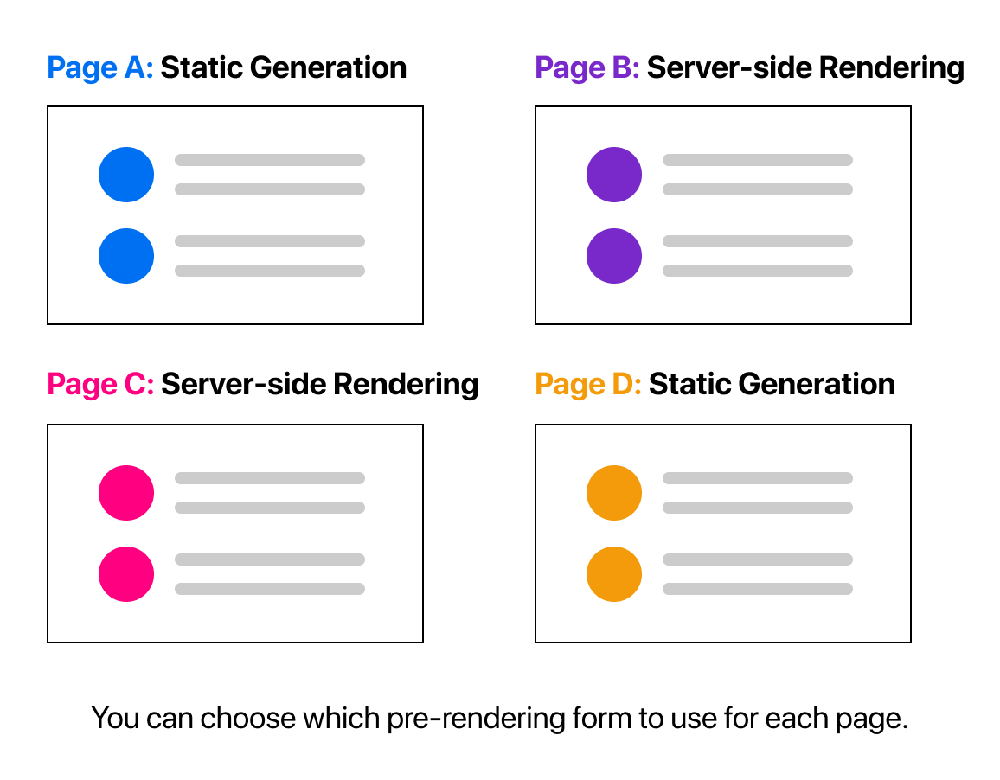

# [Next.js] Pre-rendering 개요

## Pre-rendering

Next.js의 모든 페이지는 Pre-render 방식이다. 즉, Next.js는 Client-side JavaScript에 의한 것이 아니라 미리 모든 페이지의 HTML을 생성해놓는다. Pre-rendering의 장점은 좋은 성능과 SEO를 꼽을 수 있다.

Pre-render 방식으로 생성된 HTML은 최소한의 JavaScript 코드를 갖고, 각 페이지가 브라우저에 의해 로드될 때, 비로소 완전한 상호작용이 가능한 페이지로 거듭난다. 이 과정을 `hydration`이라고 한다.

## Pre-rendering vs No Pre-redering

## Pre-rendering의 두 가지 방식

Next.js에서 제공하는 Pre-rendering 방식엔 두가지가 있다. 첫 번째는 `Static Generation`, 두 번째는 `Server-side Rendering` 방식이다. 두 방식의 차이는 `언제` HTML 페이지가 생성되는 지에 대한 타이밍에 있다.

- `Static Generation`: build 과정에서 HTML을 생성해놓고, 요청이 들어오면 해당 HTML을 client에 보낸다.

- `Server-side Rendering`: 각 요청 시에 서버에서 HTML을 생성한 후, client에게 보낸다.

> 개발 모드에서는 (`npm run dev`) 두 방식 모두 매 요청 시 pre-render된다. 즉,  `Static Generation` 방식에서도 개발 과정에서의 디버깅의 효율을 위해 build 타이밍이 아닌 요청 타이밍에 HTML 페이지를 생성한다.

## 페이지마다 다른 pre-rendering 방식

Next.js는 각 페이지마다 다른 pre-rendering 방식을 선택할 수 있다.

## `Static Generation` vs `Server-side Rendering`

Next.js는 `Static Generation` 방식을 권장한다. 이는 매 요청마다 HTML을 생성하는 `Server-side Rendering` 방식보다 빠른 성능을 내기 때문이다.

`Static Generation` 방식을 사용해야할 상황은 아래와 같다.

- Marketing pages
- Blog posts
- E-commerce product listings
- Help and documentation

사용자와 상관 없이 동일한 페이지를 제공하는 경우가 이에 해당한다. 또, 데이터가 정적이고, 변동이 적을 때 사용하기에 적합하다.

반대로, 사용자마다 데이터가 바뀌어야 하는 경우 또는 데이터의 변동이 잦을 때는 `Server-side Rendering` 방식을 사용해야 한다. (비록 속도는 떨어질지라도) 아니면 pre-rendering을 포기하고 `Client-side Rendering` 방식을 사용할 수도 있다.