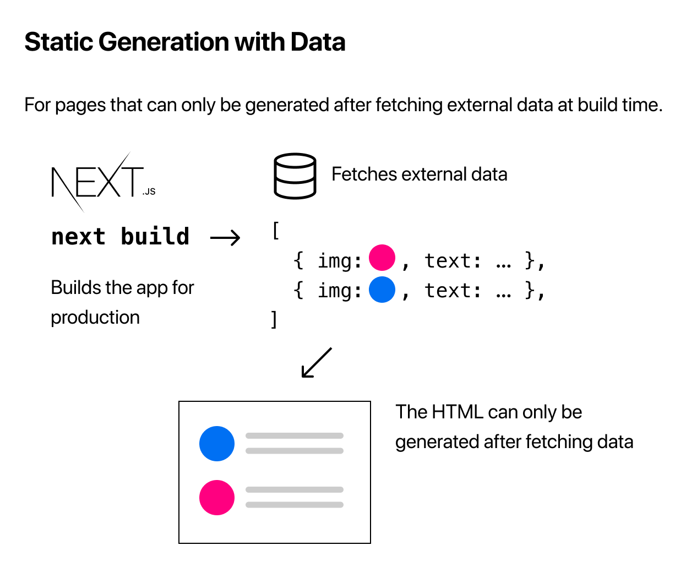

# [Next.js] pre-rendering 활용

## Static Generation with and without data

만약, 페이지에서 비동기 통신으로 data를 받아오지 않는 경우엔 `Static Generation` 방식으로 pre-rendering된다.


반면에, 비동기적으로 data를 받아와야할 경우, 즉 페이지 구성에 비동기 통신으로 받아온 data가 필요한 경우엔 아래와 같은 과정을 거쳐 rendering된다.



## Static Generation with Data using `getStaticProps`

위 방식대로 비동기 통신으로 data를 받아올 경우엔, 페이지를 구성하는 `js` 파일 내에 `getStaticProps` 라는 이름의 `async function`을 `export`해주어야 한다.

Next.js는 해당 페이지를 구성할 때, `getStaticProps` 함수에서 비동기 통신으로 data를 받아오고, 페이지의 `props`에 data를 넘겨준다. 이 과정을 통해 페이지 내에서 data를 알 수 있게 되고, 화면을 구성할 수 있게 된다.

```javascript
export default function Home({ data }) { ... }

export async function getStaticProps() {
  // Get external data from the file system, API, DB, etc.
  const data = ...

  // The value of the `props` key will be
  //  passed to the `Home` component
  return {
    props: {
        data
    }
  };
}
```

## Fetching Data at Request Time

만약 build 타이밍이 아닌 요청 시에 data를 새로 받아와야 하는 경우엔 `Server-side Rendering`을 사용할 수 있다.


## Server-side Rendering with Data using `getServerSideProps`

사용법은 간단하다. 앞서 언급한 `Static Generation` rendering 방식에서 `getStaticProps` 함수를 사용 것처럼 `getServerSideProps`로 대체해주면 된다.

```javascript
export default function Home({ data }) { ... }

export async function getServerSideProps() {
  // Get external data from the file system, API, DB, etc.
  const data = ...

  // The value of the `props` key will be
  //  passed to the `Home` component
  return {
    props: {
        data
    }
  };
}
```

`getServerSideProps`는 요청 시에 호출되므로, `context` 파라미터를 가질 수 있다. 예를 들어보자면 검색 페이지에서 검색어에 따라 `Server-side Rendering`을 구현하려면 검색어를 동적으로 받아와야 한다. 만약 url 구성이 `/search?keyword=검색어`라고 하면 `getServerSideProps`에서 `keyword` 값을 알 수 있다.

```javascript
export async function getServerSideProps(context) {
  const keyword = context.query.keyword;
  const data = callSearchAPI(keyword);

  return {
    props: {
        data
    }
  };
}
```
