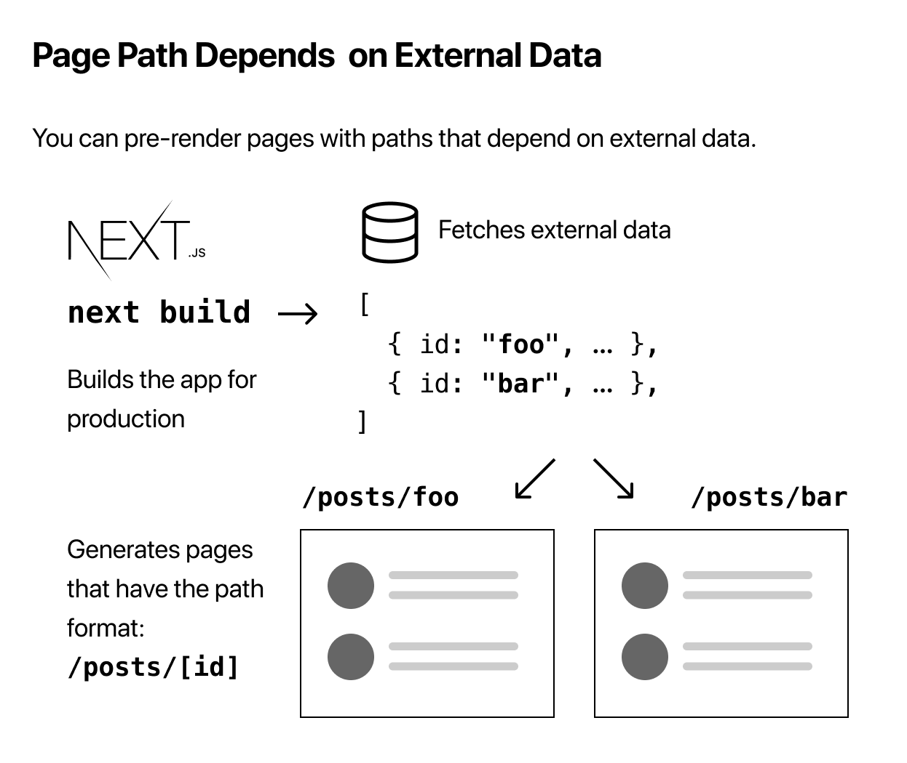
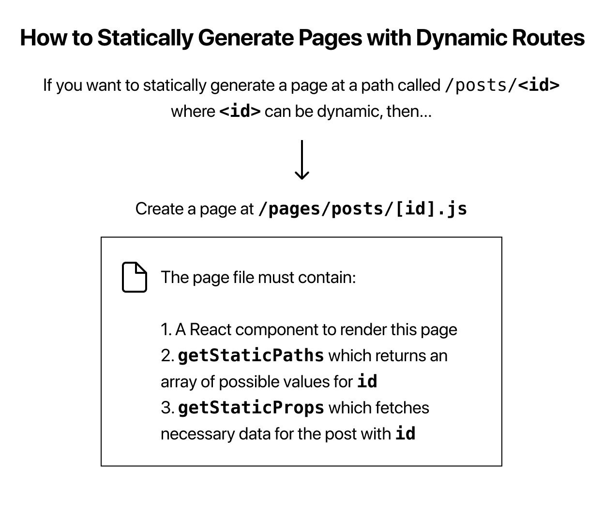

# [Next.js] Dynamic Routes

## Page Path Depends on External Data

동적 라우트란 외부 데이터에 의해 path가 정해져야할 때 사용한다. Next.js는 외부 데이터에 의한 path를 통해 페이지를 정적으로 생성하는 방식을 지원한다. 즉, 동적 URL을 가질 수 있다.




## How to Statically Generate Pages with Dynamic Routes

한 가지 예로 블로그를 생각해보자.

만약 URL이 `/posts/[id]` 형식으로 되어있다면 `dynamic-routes.md` 파일이 `/posts/dynamic-routes` 와 같이 위치해야 한다.

이를 Next.js에서는 `/pages/posts/[id].js` 의 파일 경로를 잡아주면 된다.

```javascript
import Layout from '../../components/layout';

export default function Post() {
  return <Layout>...</Layout>;
}

export async function getStaticPaths() {
  // Return a list of possible value for id
}

export async function getStaticProps({ params }) {
  // Fetch necessary data for the blog post using params.id
}
```

`getStaticPaths` 함수는 `Static Generation` 방식으로 생성할 `[id]` 값을 알려줄 때, 사용한다.

`getStaticProps` 함수에서 `params`란 dynamic Routes를 위해 받은 `[id]`값을 담고 있는 변수다.


