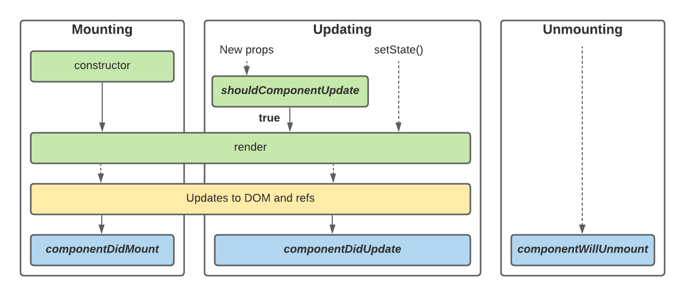

# [React.js] State와 LifeCycle

매초 업데이트되는 시계 컴포넌트를 만들며 state와 생명주기에 관해 알아보자! 앞서 배운 내용을 바탕으로 시계 컴포넌트를 작성하면 아래와 같다.

```javascript
class Clock extends React.Component {
    render() {
        return (
            <div>
                <h1>시계입니다.</h1>  
                <h6>{this.props.date.toLocaleTimeString()}</h6>
            </div>
        );
    }
}
```

부모로부터 `Date` 객체를 props로 넘겨받은 후, 출력하는 형식이다. 하지만 Clock 컴포넌트 자체에서 초마다 시간을 업데이트하는 기능을 넣고 싶다. 이 때,state가 필요하다.

## state 초기화

```javascript
class Clock extends React.Component {
    constructor(props) {
        super(props);
        this.state = { date: new Date() };
    }

    render() {
        return (
            <div>
                <h1>시계입니다.</h1>  
                <h6>{this.state.date.toLocaleTimeString()}</h6>
            </div>
        );
    }
}
```

생성자 함수에 state를 초기화할 수 있다. state는 Object 타입으로 선언해주어야 하고, state를 사용함에 따라, 기존 `render()` 함수에서 props를 꺼내쓰는 방식을 state를 쓰는 방식으로 변경해주어야 한다.

이제, 매초 마다 `state.date` 값을 바꾸고, 이를 UI 상에 업데이트 시켜보자.

## 생명주기



(출처: https://saikat-hossain.medium.com/react-lifecycle-bf83b9832be8)

컴포넌트가 처음 DOM에 렌더링될 때를 `Mount`라고 하고 `componentDidMount()` 메소드를 호출한다. 반대로 DOM에서 컴포넌트가 제거될 때를 `Unmount`라고 하고 `componentWillUnmount()` 메소드를 호출한다. 따라서, 비동기적으로 데이터를 받아오거나, 타이머 등을 등록할 때 위 생명주기 메소드를 활용하면 된다.

### 타이머 등록

```javascript
componentDidMount() {
    this.timerID = setInterval(
        () => this.setState({ date: new Date() }),
        1000
    );
}
```

타이머 등록을 하기 위해 WEB API인 `setInterval()` 메소드를 사용할 것이다. 1초마다 `setState()` 메소드를 호출하는데, 이는 state의 변화가 생겼을 때, 기존 state를 업데이트 시켜주는 메소드다. 

### 타이머 해제

Clock 컴포넌트가 DOM 에서 삭제되었을 경우, 타이머 역시 삭제해줘야 한다. 타이머 삭제는 `clearInterval()` 메소드로 할 수 있다.

```javascript
componentWillUnmount() {
    clearInterval(this.timerID);
}
```

### 코드 전문

```javascript
class Clock extends React.Component {
    constructor(props) {
        super(props);
        this.state = { date: new Date() };
    }

    componentDidMount() {
        this.timerID = setInterval(
            () => this.setState({ date: new Date() }),
            1000
        );
    }

    componentWillUnmount() {
        clearInterval(this.timerID);
    }

    render() {
        return (
            <div>
                <h1>시계입니다.</h1>  
                <h6>{this.state.date.toLocaleTimeString()}</h6>
            </div>
        );
    }
}
```

## state 사용 시, 주의사항 3가지

### state 변경은 `setState()`로!

```javascript
this.state.date = new Date(); // X
this.setState({ date: new Date() }); // O
```
state 값의 변화가 `setState()` 메소드를 통해 이뤄지지 않으면 UI에 업데이트되지 않는다. state를 직접적으로 변경하는 곳은 `constructor()`가 유일하다!!

### state 업데이트는 비동기적일수도?

`setState()`가 언제 호출될 지는 예측할 수 없다. 따라서, 이전 state 값을 활용하여 다음 state 값을 갱신해야 하는 상황이 있다면, 아래와 같이 `setState()` 메소드의 인자를 활용하면 된다.

```javascript
this.setState((state, props) => ({
  counter: state.counter + props.increment
}));
```

### 따로따로 업데이트 가능

state 내에 여러 data가 있지만 특정 data만을 변경할 때도 간단히 `setState()`를 사용하면 된다.

```javascript
constructor(props) {
    super(props);
    this.state = {
        data1: [],
        data2: []
    };
}

this.setState({ data1: list1 }); // data1만 바뀌고, data2는 그대로 유지된다.
this.setState({ data2: list2 }); // data2만 바뀌고, data1은 그대로 유지된다. 
```