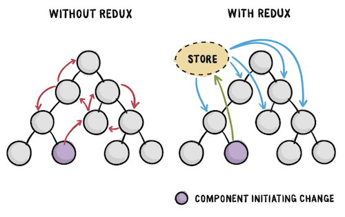
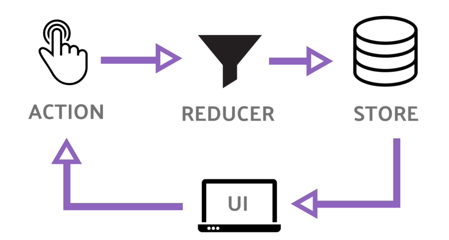

# [React.js] Flux와 Redux

## Flux 소개

Flux는 Facebook에서 사용하는 어플리케이션 아키텍쳐다. Flux를 간단하게 설명하면 데이터를 일관된 방향으로 흐르게 하기 위해 고안된 아키텍쳐다. 즉, 여러 방면에 흩어져있던 데이터의 흐름을 하나로 통일시켜 상태 관리를 파악하기 쉽게 하기 위해 만들어진 것이다.

Facebook에선 다음과 같은 문제를 해결하기 위해 Flux를 도입했다. 

(출처: https://bestalign.github.io/translation/cartoon-guide-to-flux)

Facebook엔 메시지 기능이 있고, 읽지 않은 메시지의 개수를 표시하는 기능이 있다. 각각의 대화방에선 각 대화방에 해당하는 개수를 표시해야하고, 메인 화면엔 읽지 않은 모든 메시지들의 개수를 보여줘야 한다. 각 컴포넌트들의 데이터가 합쳐져서 상위 컴포넌트의 데이터가 되는 형태를 띄고 있다.

(출처: https://c17an.netlify.app/blog/React/redux-%EC%82%AC%EC%9A%A9%ED%95%98%EA%B8%B0/article/)

위와 같이 얽히고 설킨 데이터의 흐름 때문에 잦은 버그가 발생했고, Flux를 도입하게 되었다. Flux에선 공유되는 데이터는 한 곳에서 관리한다. store라는 곳에서 각 데이터를 관장하고, 컴포넌트들은 store의 데이터를 꺼내 쓴다. 이 때도 직접적으로 데이터를 변화시키는 것이 아닌 action과 dispatcher의 흐름 아래에서 데이터를 변화시킬 수 있다.

## Redux

Redux란 Flux 아키텍쳐의 개념을 살짝 변형시켜 JavaScript로 구현한 라이브러리다. Redux엔 다음과 같은 개념이 있다.

(출처: https://c17an.netlify.app/blog/React/redux-%EC%82%AC%EC%9A%A9%ED%95%98%EA%B8%B0/article/)

### Store

store는 state를 담는 공간이다. (상태 관리 공간) 컴포넌트는 이 state를 기반으로 화면을 구성한다.

### Action

action은 state를 변화시킬 때, 사용되는 명령이다. action은 JavaScript Object로 구현되어 있고, 이 action을 reducer로 전달해 reducer가 state 조작을 한다.

### Reducer

reducer는 store에 있는 state(상태)를 조작하는 역할을 한다. action을 통해 어떠한 조작을 할 것인지, 인자는 무엇인지 등을 전달 받고, 이 곳에서 정해진 조작을 하게 된다.

## Redux 규칙

Redux엔 3가지 규칙이 있다.

> 1. state는 하나의 소스로부터  
> state는 store에서 전역적으로 관리해야 한다.
>2. state는 읽기 전용이다.  
> state에 변화가 생기면 새로운 state 객체에 업데이트를 반영하고, 대체된다. 
>3. reducer는 순수 함수여야 한다.  
> redux는 state의 주소값으로 변화를 감지한다. 따라서 reducer에서는 순수 함수로 작성하여 이전 state의 변화 없이 새로운 state를 반환하도록 작성해야 redux가 state의 변화를 감지할 수 있다.