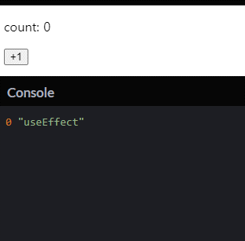
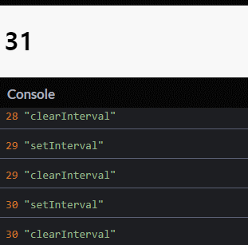

# [React.js] useEffect

## `useEffect`란?

`useEffect`는 클래스 컴포넌트 생명주기 메소드인 `componentDidMount`, `componentDidUpdate`, `componentWillUnmount`가 합쳐진 훅이다. 즉, 함수형 컴포넌트에서 클래스형 컴포넌트의 생명주기 메소드를 사용할 수 있도록 한 것이다. 예시를 통해 살펴보자.

### 예시 1. return 값이 없는 경우 = clean-up을 이용하지 않는 경우

```javascript
function Counter() {
  const [count, setCount] = useState(0);

  useEffect(() => {
    document.title = `count: ${count}`;
  }, [count]);

  return (
    <div>
      <p>count: {count}</p>
      <button onClick={() => setCount(count + 1)}>+1</button>
    </div>
  );
}
```



카운터 예제에서 `useEffect` 훅을 통해 title을 바꿔주고 있다. 위 `useEffect` 아까 언급했었던 `componentDidMount`와 `componentDidUpdate`의 역할을 하고 있다.

두번째 인자로는 배열이 들어간다. 예제에선 `[count]`를 주고 있는데, 이는 첫 렌더링과 `count`가 변할 때, 호출된다는 뜻이다. 만약, 빈 배열을 넘겨주면, 첫 렌더링 시에만 `useEffect`가 호출된다.

### 예시 2. return 값이 있는 경우 = clean-up을 이용하는 경우

```javascript
function Watch() {
  const [sec, setSec] = useState(new Date().getSeconds());

  useEffect(() => {
    const id = setInterval(() => {
      console.log(sec, "setInterval");
      setSec(new Date().getSeconds());
    }, 1000);
    return () => {
      console.log(sec, "clearInterval");
      clearInterval(id);
    };
  });

  return <h1>{sec}</h1>;
}
```



위 예제는 1초마다 현재 초를 화면에 표시해주는 예제다. WEB API인 `setInterval`을 사용해 1초마다 현재의 초를 갱신해주는데, `setInterval` 메소드엔 구독을 취소하는 `clearInterval`이 있는데, `useEffect`의 return 값으로 구독을 취소해주는 콜백 메소드를 넘겨줘야 한다.

결과를 보면 알 수 있듯이, 컴포넌트가 업데이트할 때마다 이전 상태의 구독 취소와 현재 상태의 구독 등록을 하는 것을 볼 수 있다.