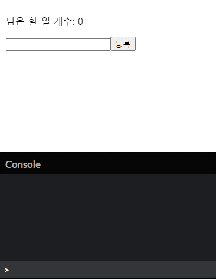

# [React.js] useMemo

## `useMemo`란?

`useMemo`는 성능 최적화를 위한 Hook 중 하나다. 이름에서부터 알 수 있듯이 어떠한 값을 Memoization 해두었다가 꺼내쓰는 녀석이다. 즉, 성능 상으로 비용이 많이 드는 값을 계산해야할 필요가 있을 때, 그 값에 영향을 주는 변수의 변화가 없는 한 memo해둔 값을 그대로 쓸 때 사용한다.

```javascript
const memoizedValue = useMemo(() => computeExpensiveValue(a, b), [a, b]);
```

사용법은 위와 같다. 렌더링할 때, `a`나 `b`가 변화가 있다면 `computeExpensiveValue`를 실행하고 그 결과 값을 `memoizedValue`에 저장한다는 뜻이다. 만약 변화가 없다면 이전 `memoizedValue` 값을 그대로 사용한다.

그럼 예제를 통해 쓰임새를 알아보자.

## 예제

본 예제는 할 일을 등록하는 예이다. 먼저 `useMemo`를 사용하지 않았을 경우, 나타날 수 있는 문제점을 살펴보자.

### `useMemo` 적용 전

```javascript
function countLeftTodo(todoList) {
  console.log(new Date().getSeconds(), "남은 할 일 계산");
  return todoList.filter((it) => !it.done).length;
}

function App() {
  const [todoList, setTodoList] = React.useState([]);
  const [content, setContent] = React.useState("");
  const [nextId, setNextId] = React.useState(0);

  const leftTodoCount = countLeftTodo(todoList);

  const handleClickTodo = (id) => {
    todoList[id].done = !todoList[id].done;
    setTodoList([...todoList]);
  };

  const handleRegister = () => {
    setTodoList([
      ...todoList,
      {
        id: nextId,
        content: content,
        done: false,
      },
    ]);
    setContent("");
    setNextId(nextId + 1);
  };

  return (
    <div>
      <p>남은 할 일 개수: {leftTodoCount}</p>
      <ul>
        {todoList.map((it) => (
          <li key={it.id} onClick={() => handleClickTodo(it.id)}>
            {it.content} ({it.done ? "완료" : "미완료"})
          </li>
        ))}
      </ul>
      <input type="text" value={content} onChange={(e) => setContent(e.target.value)} />
      <button onClick={handleRegister}>등록</button>
    </div>
  );
}

const root = ReactDOM.createRoot(document.getElementById("root"));
root.render(<App />);
```




새로운 할 일을 입력하기 위해 `input`태그에 연결된 `content` state를 변경하면 남은 할 일의 개수를 계산하는 `countLeftTodo()` 메소드가 실행된다. 새로운 할 일을 입력하는 순간순간마다 불필요한 메소드가 호출된다.

### `useMemo` 적용 후

```javascript

function countLeftTodo(todoList) {
  console.log(new Date().getSeconds(), "남은 할 일 계산");
  return todoList.filter((it) => !it.done).length;
}

function App() {
  const [todoList, setTodoList] = React.useState([]);
  const [content, setContent] = React.useState("");
  const [nextId, setNextId] = React.useState(0);

  const leftTodoCount = React.useMemo(() => countLeftTodo(todoList), [todoList]);

  const handleClickTodo = (id) => {
    todoList[id].done = !todoList[id].done;
    setTodoList([...todoList]);
  };

  const handleRegister = () => {
    setTodoList([
      ...todoList,
      {
        id: nextId,
        content: content,
        done: false,
      },
    ]);
    setContent("");
    setNextId(nextId + 1);
  };

  return (
    <div>
      <p>남은 할 일 개수: {leftTodoCount}</p>
      <ul>
        {todoList.map((it) => (
          <li key={it.id} onClick={() => handleClickTodo(it.id)}>
            {it.content} ({it.done ? "완료" : "미완료"})
          </li>
        ))}
      </ul>
      <input type="text" value={content} onChange={(e) => setContent(e.target.value)} />
      <button onClick={handleRegister}>등록</button>
    </div>
  );
}

const root = ReactDOM.createRoot(document.getElementById("root"));
root.render(<App />);
```


이전 코드와 차이점은 `useMemo`를 사용했다는 것 밖에 없다. 그 효과는 새로운 할 일의 내용을 입력할 때, `countLeftTodo()` 메소드가 실행되지 않는다는 것이다. `todoList`의 값에 변화가 없기 때문에 `countLeftTodo()` 메소드를 실행하지 않고 `useMemo`에 저장된 값을 그대로 사용한다.