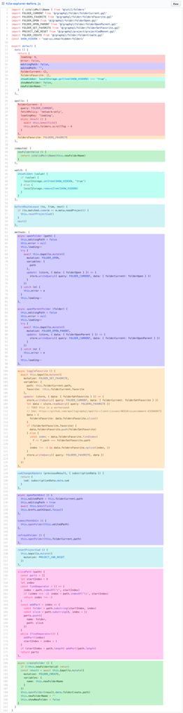

# [Vue.js] Vue 3와 Composition API

## Vue 2의 문제점

기존 Vue 2 에서는 Options API를 통해 구현했다.


옵션 별로 역할와 책임이 명확하게 구분되는 특징이 있다. 이는 어떻게 보면 큰 장점일 수 있으나, 컴포넌트의 크기가 비대해지고 기능이 많아지면 문제가 생길 수 있다. 옵션 별로 나누어져있기 때문에 같은 기능을 하는 코드가 멀어질 수 있고, 이는 가독성을 떨어뜨린다. 아래의 그림처럼 말이다.



같은 색으로 표현된 단락이 같은 기능을 하는 코드이고, option에 따라 범주화되어 있기 때문에 논리를 파악하려면 많은 스크롤 이동이 필요하다.

Vue 3는 이 문제로부터 출발했다. 마치 React에서 클래스 컴포넌트에서 hook과 함께 함수형 컴포넌트로 넘어간 것처럼 말이다. 위 그림에서 같은 색의 단락을 한 곳으로 모으는 게 Vue 3의 목표인 것 같다.

## Composition API


Vue 3에선 Vue 2의 Options API를 그대로 두고, 중요한 옵션을 하나 추가했다. `setup` 옵션은 컴포넌트가 생성되기 전에 실행된다. 따라서, Options API로 생성한 `data`, `methods`등에 접근할 수 없고, `setup`의 라이프사이클에서 `created` 부분이 사라졌다. 오직 `props`와 `context`에 접근할 수 있다.

## Vue 3 예

기존 Vue 2와 `Options API`는 Vue 3의 `setup`에 의해 완전 대체될 수 있는 것 같다. `setup`와 `Options API`의 옵션으로 사용하면 아래와 같다.

```javascript
<template>
  <h1>{{msg}}</h1>
</template>

<script>
import { ref } from "vue";

export default {
  setup() {
    const msg = ref("Hello World!!");
    return { msg };
  }
}
</script>
```

위와 같이 사용하면 `setup` 내에서 View 단(`template`)에서 사용할 데이터를 모두 return 시켜줘야하는 귀찮음이 따른다. Vue 3는 이 불편함을 해소시켜줄 script setup 문법이 있다.

```javascript
<template>
  <h1>{{msg}}</h1>
</template>

<script setup>
import { ref } from "vue";

const msg = ref("Hello World!!");
</script>
```

return 할 필요 없이 msg 변수를 바로 `template`에서 사용할 수 있다.

## `setup`의 장점

앞서 언급한 Vue 2의 문제점 중 하나였던 같은 기능을 하는 코드의 분산을 `setup`을 통해 어떻게 해결할 수 있는지 알아보자.

```javascript
<template>
  <h1>{{count}}</h1>
  <button @click="incrementCount">+1</button>
</template>

<script>
export default {
  data() {
    return {
      count: 0,
    };
  },
  methods: {
    incrementCount() {
      this.count++;
    },
  },
}
</script>
```

위는 카운터 예제인데, 지금은 `data`가 count 밖에 없어 아주 적절한 예는 아니지만, `Options API`를 사용해 `data`와 `methods`의 옵션별로 코드가 구분된다. `count`와 `incrementCount`는 논리적으로 하나의 코드라고 볼 수 있음에도 말이다. 만약, 다른 기능을 하는 `data`와 `methods`, `computed`와 생명주기 로직들이 추가된다면 더더욱 복잡한 컴포넌트가 될 것이다. 이를 Vue 3의 `setup`을 이용해 다시 작성하면 아래와 같다.

```javascript
<template>
  <h1>{{count}}</h1>
  <button @click="incrementCount">+1</button>
</template>

<script setup>
import { ref } from "vue";

const count = ref(0);
const incrementCount = () => {
  count.value++;
};
</script>
```

`count`와 `incrementCount`의 물리적 거리가 줄어든 것을 볼 수 있다. 코드의 논리를 파악하기에 훨씬 용이해졌다고 할 수 있다. 여기서 한 단계 더 나아가 커스텀 훅을 작성하면 더욱 간단한 코드가 될 수 있다.

```javascript
import { ref } from "vue";

const useCount = () => {
  const count = ref(0);
  const incrementCount = () => {
    count.value++;
  };

  return { count, incrementCount };
};
```

```javascript
<template>
  <h1>{{count}}</h1>
  <button @click="incrementCount">+1</button>
</template>

<script setup>
const { count, incrementCount } = useCount();
</script>
```

`count`와 `incrementCount`를 하나의 훅으로 묶어 별도의 파일로 구분한다면 더욱 깔끔한 코드가 될 수 있다. `setup`에선 vue의 라이프사이클 메소드도 사용할 수 있기 때문에 기존엔 불가능했던 재사용성도 얻을 수 있다.
