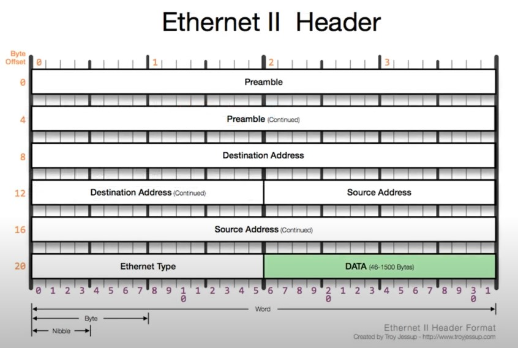

# [네트워크] 2계층

## 2계층이 하는 일

2계층은 하나의 네트워크 대역 즉, 같은 네트워크(LAN) 상에 존재하는 여러 장비들 중에서 어떤 장비가 어떤 장비에게 보내는 데이터를 전달.

추가적으로 `오류 제어`, `흐름 제어` 수행

- 오류 제어: 데이터에 오류가 있는지
- 흐름 제어: 데이터가 어디로 가는지

다른 네트워크와 통신할 때는 항상 3계층이 도와주어야 한다.

3계층의 주소와 3계층의 프로토콜을 이용해야만 다른 네트워크와 통신이 가능하다.

## 2계층에서 사용하는 주소 - `MAC 주소`

LAN에서 통실할 때, 사용하는 `MAC 주소`. 물리적 주소. 6바이트로, 16진수를 씀.

MAC 주소 예) 6C-29-95-04-EB-A1

6진수 12자리로 표현. 앞의 6자리는 `OUI`. IEEE에서 부여하는 일종의 제조회사 식별 ID. 뒤의 6자리는 제조사에서 부여한 고유 번호. 

## 2계층 프로토콜

- Ethernet 프로토콜

- Destination Address(6 byte): 목적지 MAC 주소
- Source Address(6 byte): 발신지 MAC 주소
- Ethernet Type(2 byte): 상위 프로토콜 타입. IPv4(0x0800), ARP(0x0806)