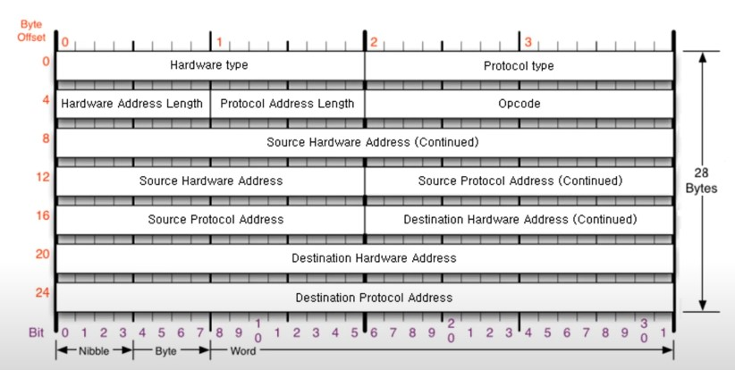
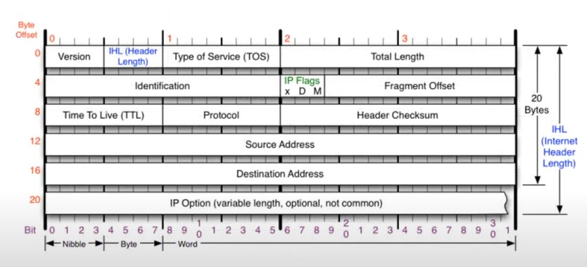
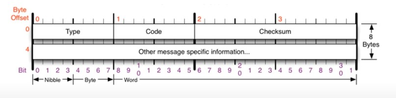

# [네트워크] 3계층

## 3계층이 하는 일

3계층은 다른 네트워크 대역 즉, 멀리 떨어진 곳에 존재하는 네트워크까지 어떻게 데이터를 전달할지 제어하는 일을 담당.

발신에서 착신까지의 패킷의 경로를 제어

## 3계층에서 사용하는 주소 - `IP 주소`

WAN에서 통신할 때 사용하는 `IP 주소`. 4바이트로, 10진수로 씀.

- IPv4 주소: 현재 PC에 할당된 IP 주소
- 서브넷 마스크: IP 주소에 대한 네트워크 대역을 규정하는 것
- 게이트웨이 주소: 외부와 통신할 때, 사용하는 네트워크의 출입구

### Classful IP 주소

|클래스|네트워크 구분|시작 주소|마지막 주소|
|---|---|---|---|
|A 클래스|0XXXXXXX, 첫번째 필드|0.0.0.0|127.255.255.255|
|B 클래스|10XXXXXX, 두번째 필드|128.0.0.0|191.255.255.255|
|C 클래스|100XXXXX, 세번째 필드|192.0.0.0|223.255.255.255|
|D 클래스(멀티캐스트)|1110XXXX|224.0.0.0|239.255.255.255|
|E 클래스(예약)|1111XXXX|240.0.0.0|255.255.255.255|

### Classless IP 주소

Classful IP 주소로는 구분되는 위치가 정해져 있고, 이 때문에 IP 주소의 낭비가 생겼다. 4바이트로 표현할 수 있는 수는 한정되어 있지만, 각 바이트가 모두 사용되지 못함. Classless IP 주소가 탄생함.

서브넷 마스크가 도입됨. 서브넷 마스크는 어디까지가 네트워크 대역을 구분하는데 사용하고, 어디서부터 호스트를 구분하는데 사용하는지 지정.

서브넷 마스크 예)

- 서브넷 마스크: 255.255.255.192 -> 11111111.11111111.11111111.11000000

1인 부분이 네트워크 대역, 0인 부분이 PC.

### 사설 IP와 공인 IP

Classful IP 주소에서 Classless IP 주소로 넘어간 것과 마찬가지로, 4바이트로 표현하는 숫자가 너무 적어 고안된 개념. 공인 IP 1개 당 2^32개의 사설 IP를 갖는다.

- 사설 IP: 같은 네트워크 대역에서 사용하는 IP 주소
- 공인 IP: 외부 네트워크 대역에서 사용하는 IP 주소

### 특수한 IP 주소

- 0.0.0.0: Wildcard, 나머지 모든 IP
- 127.0.0.1: 자기 자신을 나타내는 주소
- 게이트웨이 주소: 외부 네트워크 대역으로 통신하기 위한 IP 주소. (공유기 IP)

## 3계층 프로토콜

- ARP 프로토콜

- IPv4 프로토콜

- ICMP 프로토콜

