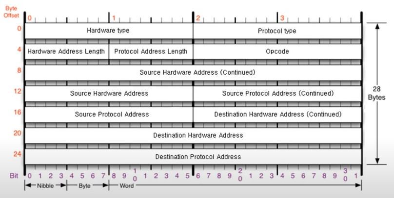

# [네트워크] ARP 프로토콜

## ARP 프로토콜이란?

ARP 프로토콜은 같은 네트워크 대역에서 통신을 하기 위해 필요한 MAC 주소를 IP주소를 통해 알아오는 프로토콜이다.

같은 네트워크 대역에서 통신을 한다고 하더라도 데이터를 보내기 위해서는 7계층부터 캡슐화를 통해 데이터를 보내기 때문에 IP주소와 MAC주소가 모두 필요하다. 이 때, IP 주소는 알고 MAC 주소는 모르더라도 ARP 프로토콜을 통해 통신을 할 수 있다.

## ARP 프로토콜 구조

- Hardware type (2 바이트): 2계층 프로토콜 타입 (주로 이더넷 0x0001)
- Protocol type (2 바이트): 3계층 프로토콜 타입 (주로 IPv4 0x0800)
- Hardware Address Length: 2계층 프로토콜 주소 길이 (0x0006)
- Protocol Address Length: 3계층 프로토콜 주소 길이 (0x0004)
- Opcode: 물어볼 땐 1, 응답할 땐 2
- Source Hardware Address (6 바이트): 발신 MAC 주소
- Source Protocol Address (4 바이트): 발신 IP 주소
- Destination Hardware Address (6 바이트): 수신 MAC 주소
- Destination Protocol Address (4 바이트): 수신 IP 주소