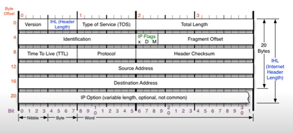

# [네트워크] IPv4 프로토콜

## IPv4 프로토콜이란?

네트워크 상에서 데이터를 교환하기 위한 프로토콜. **데이터가 정확하게 전달될 것을 보장하지 않는다.** 중복된 패킷을 전달하거나 패킷의 순서를 잘못 전달할 가능성도 있다. 데이터의 정확성과 순차적인 전달은 상위 프로토콜인 ICP에서 보장한다.

## IPv4 프로토콜 구조

- 옵션이 안붙으면 20바이트! 옵션이 최대로 붙으면 60바이트, 하나 당 4바이트

- Version (0.5 바이트): IP 버전 (보통 4)
- IHL (0.5 바이트): 바이트 수를 4로 나눈 값 (보통 5 = 20바이트)
- Type of Service (1 바이트): 옛날에 쓰던 값 (보통 0)
- Total Length (2 바이트): 총 바이트
- Identification (2 바이트): 패킷을 쪼개서 보낼 수 있기 때문에, 이 값을 이용해 같은 데이터임을 알 수 있다.
- IP Flags (3 비트): 첫 비트는 안 씀. 두번째 비트(D): Don't Fragmentation: 데이터를 쪼개지 않을 때, 1. 세번째 비트(M): More Fragmentation: 패킷을 쪼개서 보내는 경우에 남은 패킷이 있을 때, 1
- Fragment Offset (13 비트): 패킷의 순서를 알려줌. 시작 패킷이면 0, 2번째 패킷이면 첫번째 패킷의 크기.
- Time To Live (1 바이트): 패킷의 생존 Depth. 
- Protocol (1 바이트): 상위 프로토콜 타입.
- Header Checksum (2 바이트): 헤더가 정확한 데이터인지 계산.
- Source Address (4 바이트): 출발지 IP주소
- Destination Address (4 바이트): 도착지 IP주소

