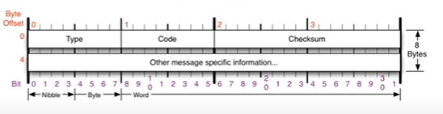

# [네트워크] ICMP 프로토콜

## ICMP 프토토콜이란?

ICMP (Internet Control Message Protocol) 인터넷 제어 메시지 프로토콜. 네트워크 컴퓨터 위에서 돌아가는 운영체제에서 오류 메시지를 전송 받는 데 주로 쓰인다. 프로토콜 구조의 Type과 Code를 통해 오류 메시지를 전송 받는다.

## ICMP 프토토콜 구조

 

 - Type (1 바이트): 대분류

    - 0: 응답.
    - 8: 요청.
    - 3: Destination Unreachable. 상대가 받지 못함. 경로가 잘못될 가능성.
    - 11: Time Exceeded. 상대가 받았지만 문제가 생김. 방화벽의 경우.
    - 5: ICMP Redirect. 경로 재설정.

 - Code (1 바이트): 소분류