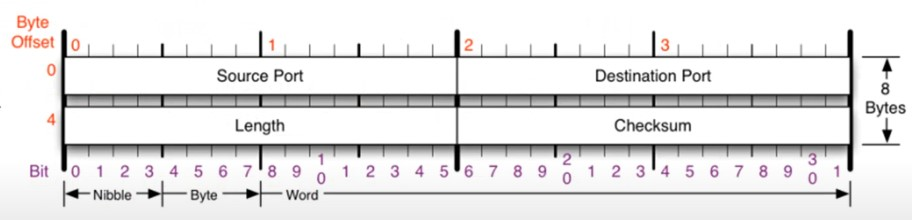

# [네트워크] 4계층 UDP 프로토콜

## UDP란?

사용자 데이터그램 프로토콜(User Datagram Protocol)은 유니버셜 데이터그램 프로토콜(Universal Datagram Protocol)이라고도 한다. (비연결지향형)

UDP의 **전송 방식은 너무 단순**해서 서비스의 **신뢰성이 낮고**, 데이터그램 도착 순서가 바뀌거나, 중복되거나, 심지어는 통보 없이 누락되기도 한다.

UDP는 일반적으로 **오류의 검사와 수정이 필요 없는** 프로그램에서 수행할 것으로 가정한다.

## UDP 프로토콜의 구조

- Source Port(2 바이트): 출발지 포트번호
- Destination Port(2 바이트): 도착지 포트번호
- Length(2 바이트): 헤더 + 바디 + 데이터의 길이
- Checksum(2 바이트): 오류 검사

## UDP 프로토콜을 사용하는 대표적인 프로그램들

- DNS 서버: 도메인을 물으면 IP 주소를 알려주는 역할
- RIP 프로토콜: 라우팅 정보를 공유