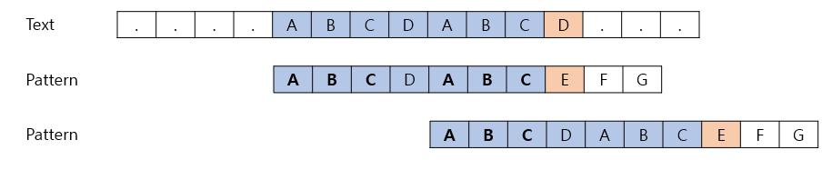
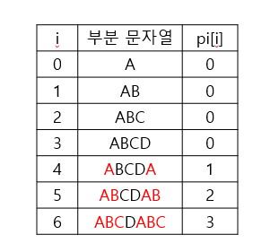

# [알고리즘] KMP (Knuth-Morris-Pratt Algorithm)

- 불일치가 발생한 텍스트 문자열의 앞 부분에 어떤 문자가 있는지 알고 있으므로, 다시 비교하지 않고 이용하는 방법!
- 패턴을 전처리하여 부분 일치 배열 pi[k]를 구해서 최적화함.
    - pi[k]: 처음부터 k 인덱스를 끝으로 하는 부분 문자열에서 접두사와 접미사가 일치하는 최대 길이
- 시간 복잡도: O(M+N)




위와 같은 원본(Text)이 있을 때, 일치하는 패턴(Pattern)을 찾는다고 해보자.

첫 시도에서 ABC라는 공통 접미/접두사를 발견했기 때문에, 다음 시도에서 그 정보를 이용해 건너뛴 다음 비교를 진행하겠다는 이야기다.

## 부분 일치 배열 구하기

- 먼저 패턴의 부분 일치 배열의 길이를 구하자. 패턴이 “ABCDABC”라고 했을 때, 아래와 같은 pi 배열을 구할 수 있다.
    
    (왜 배열 이름을 pi라고 하는지 잘 모르겠다. 추측으로는 PatternIndex가 아닐까 싶다. **패턴의 i번째 index까지의 부분 문자열 중 접두사와 접미사가 일치하는 부분의 길이**를 뜻한다.)
    



### 구현

```java
int[] getPi(char[] pattern) {
    int[] pi = new int[pattern.length];

    for (int i = 1, j = 0; i < pattern.length; i++) {
        while (0 < j && pattern[i] != pattern[j]) {
            j = pi[j - 1];
        }

        if (pattern[i] == pattern[j]) {
            pi[i] = ++j;
        }
    }

    return pi;
}
```


```java
List<Integer> kmp(char[] text, char[] pattern, int[] pi) {
    List<Integer> result = new LinkedList<>();

    for (int i = 0, j = 0; i < text.length; i++) {
        while (0 < j && text[i] != pattern[j]) {
            j = pi[j - 1];
        }

        if (text[i] == pattern[j]) {
            if (j == pattern.length - 1) {
                result.add(i - j);
                j = pi[j];
            } else {
                j++;
            }
        }
    }

    return result;
}
```