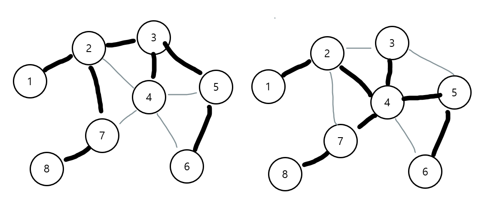

# [알고리즘] 크루스칼 알고리즘 (kruskal’s Algorithm)

## 신장 트리 (Spanning Tree)

-   어떤 그래프 안에 있는 모든 노드를 연결하는 트리
-   신장 트리는 여럿 있을 수 있다.
    
    
## 최소 신장 트리 (Minimum Spanning Tree)

-   신장 트리 중 비용이 최소인 트리 → 최소 비용 신장 트리
-   노드가 N개인 그래프에서 최소 신장 트리의 엣지의 개수 = N - 1
-   MST에서 사용하는 개념
    
    -   순환 (Cycle)
        -   한 노드에서 시작해서 해당 노드로 끝나는 경로
    -   컷 (Cut)
        -   어떤 그래프를 서로소(Disjoint)인 두 하위 집합으로 나누는 행위
        -   그래프의 노드들을 두 그룹으로 분리시키는 것
        -   컷 세트(Cut-Set): 두 그룹을 연결하는 엣지들의 집합 → 이 엣지들을 제거하면 그래프가 둘로 분리됨.
    -   컷 속성 (Cut Property)
        -   컷 세트에 가중치가 다른 여러 엣지가 있을 경우
        -   이 때, MST에 포함되는 엣지는 가중치가 가장 작은 엣지!!
    
    
    

## MST 알고리즘

-   크러스컬 알고리즘 (Kruskal’s Algorithm)
-   프림 알고리즘 (Prim’s Algorithm)

## 크루스칼 알고리즘 (kruskal’s Algorithm)

```
1. 그래프의 각 노드마다 그 노드만 포함하는 트리(서로소 집합)를 만듦.
2. 모든 엣지 가중치를 오름차순으로 정렬 (S 배열이라고 칭함)
3. S가 비거나 MST가 완성될 때까지 다음 과정을 반복
    1. S에서 가중치가 가장 작은 엣지를 제거해서 고려
    2. 이 엣지가 트리를 연결하는지 검사
        1. 그렇다면 MST에 추가
        2. 아니라면 버림
```

## 구현

```
import java.util.Arrays;

public class Kruskal {

    static final int N = 8;

    public static void main(String[] args) {
        Edge[] edges = {
                new Edge(1, 2, 5),
                new Edge(2, 1, 5),
                new Edge(2, 7, 11),
                new Edge(2, 4, 1),
                new Edge(2, 3, 2),
                new Edge(3, 2, 2),
                new Edge(3, 4, 2),
                new Edge(3, 5, 9),
                new Edge(4, 2, 1),
                new Edge(4, 3, 2),
                new Edge(4, 5, 3),
                new Edge(4, 6, 10),
                new Edge(4, 7, 8),
                new Edge(5, 3, 9),
                new Edge(5, 4, 3),
                new Edge(5, 6, 5),
                new Edge(6, 4, 10),
                new Edge(6, 5, 5),
                new Edge(7, 4, 8),
                new Edge(7, 2, 11),
                new Edge(7, 8, 13),
                new Edge(8, 7, 13),
        };

        System.out.println(kruskal(edges));
    }

    static int kruskal(Edge[] edges) {
        int[] set = {0, 1, 2, 3, 4, 5, 6, 7, 8};

        Arrays.sort(edges);

        int cnt = 0;
        int answer = 0;
        for (Edge edge : edges) {
            if (unionSet(set, edge.from, edge.to)) {
                answer += edge.weight;
                cnt++;
            }
            if (cnt == N - 1) {
                break;
            }
        }
        return answer;
    }

    static int findSet(int[] parents, int a) {
        if (a == parents[a]) {
            return a;
        }
        return parents[a] = findSet(parents, parents[a]);
    }

    static boolean unionSet(int[] parents, int a, int b) {
        int rootA = findSet(parents, a);
        int rootB = findSet(parents, b);
        if (rootA == rootB) {
            return false;
        }
        parents[rootB] = rootA;
        return true;
    }

    static class Edge implements Comparable<Edge> {
        int from;
        int to;
        int weight;

        public Edge(int from, int to, int weight) {
            this.from = from;
            this.to = to;
            this.weight = weight;
        }

        @Override
        public int compareTo(Edge o) {
            return Integer.compare(weight, o.weight);
        }
    }
}
```