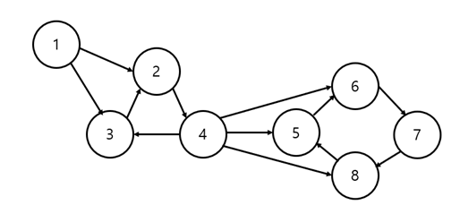
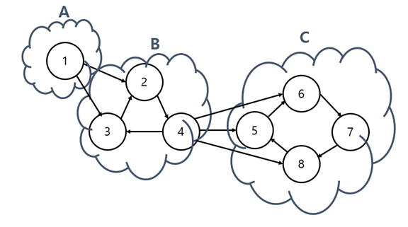
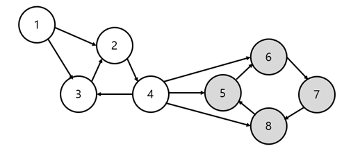
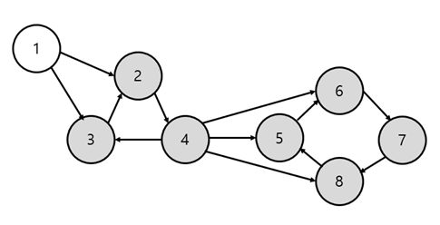
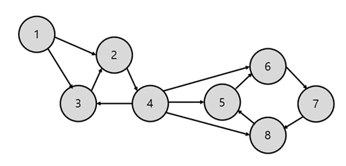
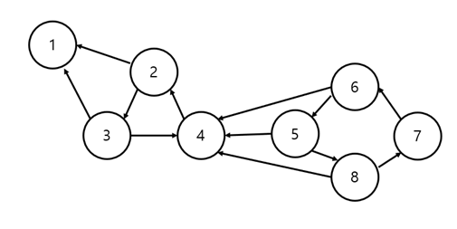
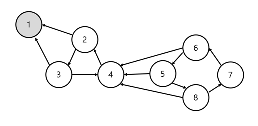
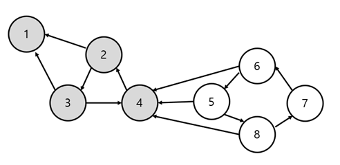
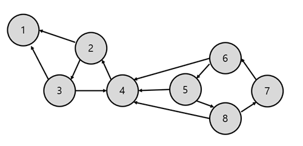

# [알고리즘] 강한 결합 요소 (Strongly Connected Component)

## 강한 결합 요소

강한 결합 요소란 말 그대로 그래프 안에서 강하게 결합되어 있는 요소들을 뜻한다. 다르게 말하면 요소가 직간접적으로 연결되어 있음을 말한다.

예를 들어보자.

위와 같은 그래프가 있을 때, {2, 3, 4} 는 강한 결합 요소라고 할 수 있다. {2, 3, 4} 에서 아무 노드 A에서 다른 노드 B로 갈 수 있기 때문이다. (직간접적으로 연결되어 있다.)

이어서, 강한 결합 요소를 모두 찾아보면 {1}, {2, 3, 4}, {5, 6, 7, 8} 이다.

## 위상 정렬과 강한 결합 요소

그렇다면 강한 결합 요소를 어디다가 써먹을 수 있을까? 바로 위상 정렬이다.

위상 정렬을 하기 위해선 방향 비순환 그래프(DAG, Directed Acyclic Graph)여야 한다. 크기가 2 이상인 강한 결합 요소가 있으면 안된다는 뜻이다. 하지만 강한 결합 요소의 개념을 사용하면 위상 정렬이 가능해진다.

또, 예를 들어보자.

앞에서 찾은 강한 결합 요소에다 A, B, C라고 이름을 붙여줬다. 이 상태에서 위상 정렬을 하면

A -> B -> C

일 것이다.

이처럼 강한 결합 요소를 노드처럼 치환해주면 위상 정렬에 용이한 DAG 형태로 변하게 된다.

그럼 이제 강한 결합 요소를 구하는 알고리즘에 대해 알아보자.

## 코사라주(Kosaraju) 알고리즘

1.  그래프 G를 DFS 후위 순회한다.
2.  그래프 G의 전치 그래프인 T를 구한다. (T: G와 방향이 반대인 그래프)
3.  그래프 T에 과정 1에서 구한 결과의 역순을 토대로 DFS를 진행한다.

코사라주 알고리즘은 위와 같다. DFS 2번만 돌려주면 결과를 얻을 수 있다.

이것도 예를 들어보자.

아무 노드에서 1번 과정을 시작한다. 1번 노드부터 하면 재미없으니까, 8번 노드부터 거꾸로 진행해보겠다.

## 과정 1

-   DFS 후위 순회 결과: 7 - 6 - 5 - 8 (8번 노드에서 출발)

-   DFS 후위 순회 결과: 7 - 6 - 5 - 8 - 2 - 3 - 4 (4번 노드에서 출발)

-   DFS 후위 순회 결과: 7 - 6 - 5 - 8 - 2 - 3 - 4 - 1 (1번 노드에서 출발)

## 과정 2

전치 그래프인 T를 구한다. (화살표 방향만 바꿔주면 된다. u -> v => v -> u)

## 과정 3

전치 그래프인 T에서 1번 결과의 역순으로 DFS를 실행해보자.

먼저, 1번 과정의 역순을 구해보면

-   DFS 후위 순회 결과의 역순: 1 - 4 - 3 - 2 - 8 - 5 - 6 - 7

-   찾은 강한 결합 요소: {1} (1번 노드에서 출발)

-   찾은 강한 결합 요소: {1}, {4, 2, 3} (4번 노드에서 출발)

-   찾은 강한 결합 요소: {1}, {4, 2, 3}, {8, 7, 6, 5} (8번 노드에서 출발)