# [알고리즘] 다익스트라 (dijkstra)

## 다익스트라 알고리즘이란?

-   가중치가 있는 그래프 안에서 두 노드간의 최단 거리를 구할 때, 사용된다.
-   실생활에서 나름 사용되는 듯 하다. (길 찾기, 최단 경유 항공편 찾기 등)
-   간선의 가중치가 음수일 때, 작동하지 않는다.
-   우선순위 큐를 사용하면 O((N + E)logN)의 시간 복잡도를 갖는다.

다익스트라 동작 과정은 아래와 같다.

-   모든 노드를 방문하면서 아래와 같은 과정을 반복한다.
    1.  아직 방문하지 않은 노드 중 가장 가까운 노드 n을 선택한다.
    2.  n의 각 이웃 노드 m과 거리(n까지의 거리 + n과 m사이의 거리)를 계산한다.
    3.  2번 과정에서 얻은 거리 값이 기존에 구한 거리보다 작다면 갱신해준다.  
        (알고리즘 시작할 때, 거리를 기록하는 배열을 만들고, Int.MAX\_VALUE로 초기화해줘야 함!)

## 예를 들어보자

아래와 같은 그래프가 있을 때, 1번 노드에서 출발하여 3번 노드에 도착할 때까지의 최소 거리를 다익스트라 알고리즘을 통해 구해보자!

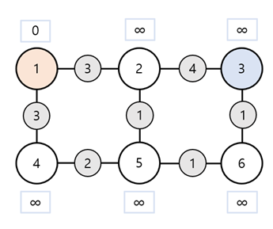

파란색 네모 상자에 적힌 값은 1번 노드로부터의 거리다. 초기 상태는 무한으로 설정했다.

## 1회전 (1번 노드 방문)

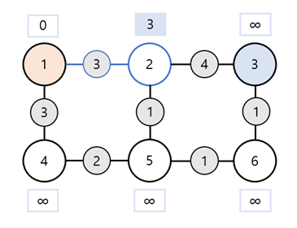

1번 노드까지의 거리 + 1번 노드와 2번 노드 사이의 거리 < 2번 노드까지의 거리 (distance\[1\] + edge\[1\]\[2\] < distance\[2\]) 이므로 2번 노드까지의 거리를 갱신해준다.

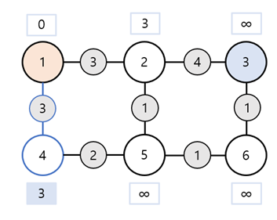

4번 노드를 대상으로 같은 작업을 실행해준다.

## 2회전

### 2번 노드 방문

이제 1번 노드에서의 작업은 끝났고, 1번 노드와 연결되어 있는 2번, 4번 노드를 순차적으로 방문할 것이다. (2번, 4번 노드까지의 거리가 3으로 같기 때문에 둘 다 방문.)

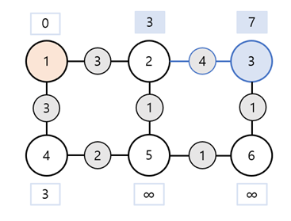

3번 노드까지의 거리를 갱신해주고~

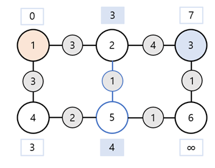

5번도 갱신해준다.

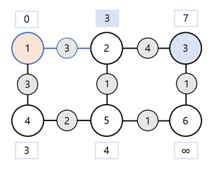

이 때, 1번 노드와도 연결되어 있어서 탐색을 하는데, 2번 노드까지의 거리(3) + 2번 노드와 1번 노드 사이의 거리(3) > 1번 노드까지의 거리(0) (3 + 3 > 0) 이므로 1번 노드까지의 거리는 갱신해주지 않는다.

### 4번 노드 방문

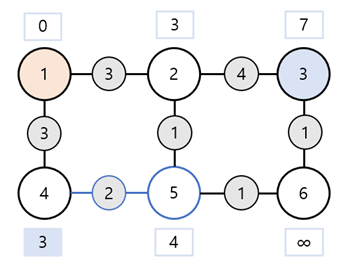

5번 노드까지의 거리가 더 작으니 갱신하지 않는다.

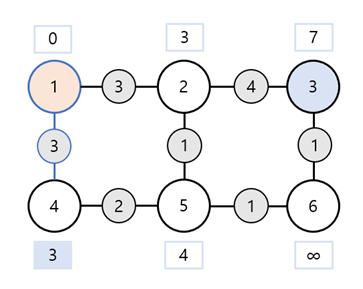

마찬가지로, 1번 노드까지의 거리가 더 작아 갱신하지 않는다.

## 3회전 (5번 노드 방문)

방문해야할 노드가 3번, 5번이 있는데, 5번 노드까지의 거리가 더 짧으므로 5번 노드를 먼저 방문한다.

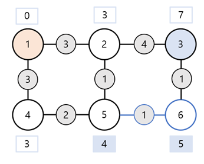

마찬가지로 갱신할 수 있는 6번 노드의 거리만 바꿔준다.

4번 노드, 2번 노드는 생략한다. (갱신이 일어나지 않는다.)

## 4회전 (6번 노드 방문)

방문해야할 노드가 3번, 6번이 있는데, 6번 노드가 더 가까워 6번 노드 먼저 방문한다.

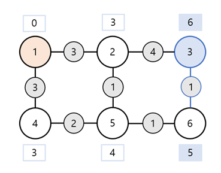

6번까지의 거리(5) 6번과 3번 노드 사이의 거리(1) < 3번 노드까지의 거리(7) 이므로 3번 노드까지의 거리를 6으로 갱신해준다.

## 5회전 (3번 노드 방문)

이제 남은 노드가 3번인데, 갱신할 거리가 없으므로 생략하겠다.

## 코드

위 과정을 코드로 구현해보자.

```kotlin
import java.util.*

lateinit var graph: Array<IntArray>
lateinit var distance: IntArray

fun main() {
    init()
    dijkstra()
    distance.forEach {
        print("$it ")
    }
}

fun init() {
    graph = arrayOf(
        intArrayOf(0, 3, 0, 3, 0, 0),
        intArrayOf(3, 0, 4, 0, 1, 0),
        intArrayOf(0, 4, 0, 0, 0, 1),
        intArrayOf(3, 0, 0, 0, 2, 0),
        intArrayOf(0, 1, 0, 2, 0, 1),
        intArrayOf(0, 0, 1, 0, 1, 0),
    )
    distance = IntArray(6) { Int.MAX_VALUE }
}

fun dijkstra() {
    distance[0] = 0
    val priorityQueue = PriorityQueue<Int>() { i1, i2 ->
        distance[i1].compareTo(distance[i2])
    }.apply { add(0) }
   

    while (priorityQueue.isNotEmpty()) {
        val current = priorityQueue.poll()
        for (next in 0 until 6) {
            if (graph[current][next] != 0 && distance[current] + graph[current][next] < distance[next]) {
                distance[next] = distance[current] + graph[current][next]
                priorityQueue.add(next)
            }
        }
    }
}
```

## 실행 결과

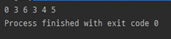