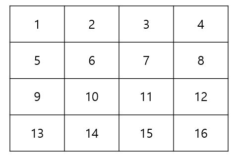
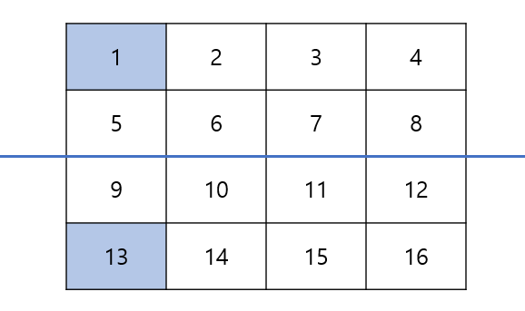
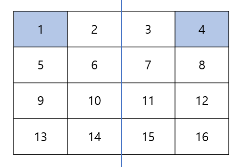
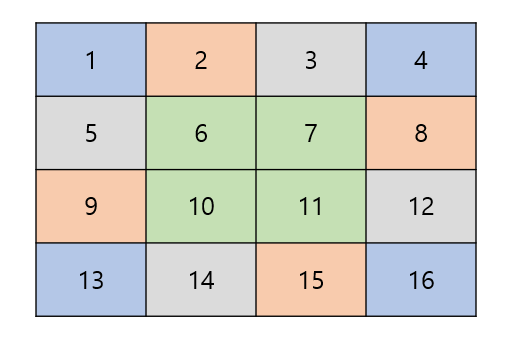

# [알고리즘] 배열 회전 알고리즘

배열 회전 알고리즘을 정리해보자!

## 상하반전



위와 같은 4x4 배열이 있다고 해보자.

상하 반전의 경우, 아래 표처럼 중앙선을 기준으로 위쪽 요소들만 대칭이동 시켜주면 된다.



```kotlin
for (r in 0 until n / 2) {
    for (c in 0 until m) {
        val temp = array[r][c]
        array[r][c] = array[n - 1 - r][c]
        array[n - 1 - r][c] = temp
    }
}
```

## 좌우반전



좌우반전은 상하반전과 똑같은 과정으로 진행해주면 된다.

```kotlin
for (r in 0 until n) {
    for (c in 0 until m / 2) {
        val temp = array[r][c]
        array[r][c] = array[r][n - 1 - c]
        array[r][n - 1 - c] = temp
    }
}
```

## 시계/반시계 방향 회전

시계/반시계 방향 회전 같은 경우, 배열을 복사하면 간단히 진행할 수 있지만 목표는 배열 복사 없이 진행하는 것이다.

회전같은 경우 아래와 같은 규칙을 찾을 수 있다.



같은 색으로 표현된 요소들을 시계/반시계 방향으로 스왑해주면 된다.

1이 있던 자리에 13을, 4가 있던 자리에 1을, 16이 있던 자리에 4를 13이 있던 자리에 16을 넣어주면 된다.

이러한 과정을 바깥 껍질에서부터 진행해주면 된다.

-   시계 방향
    
    ```kotlin
    for (r in 0 until n / 2) {
      for (c in r until n - 1 - r) {
          val temp = array[r][c]
          array[r][c] = array[n - 1 - c][r]
          array[n - 1 - c][r] = array[n - 1 - r][n - 1 - c]
          array[n - 1 - r][n - 1 - c] = array[c][n - 1 - r]
          array[c][n - 1 - r] = t
      }
    }
    ```
    

-   반시계 방향
    
    ```kotlin
    for (r in 0 until n / 2) {
      for (c in r until n - 1 - r) {
          val temp = array[r][c]
          array[r][c] = array[c][n - 1 - r]
          array[c][n - 1 - r] = array[n - 1 - r][n - 1 - c]
          array[n - 1 - r][n - 1 - c] = array[n - 1 - c][r]
          array[n - 1 - c][r] = t
      }
    }
    ```