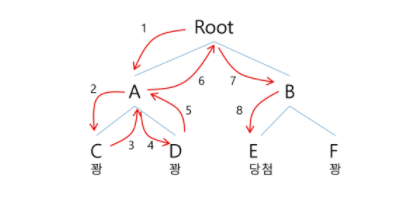
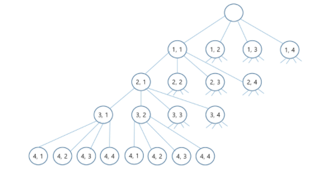

# [알고리즘] 백트래킹

- 퇴각 검색
- 모든 조합을 시도해서 문제의 해를 찾는다.



- 재귀 함수로 구현
- 어떤 경우의 수들의 조합을 따져보면 아래처럼 트리 모양을 띈다. 이 트리를 상태 공간 트리(state space tree)라고 한다.



- 완전 탐색과 다른 점은??
    - 어떤 시도를 할 때, 부모 노드가 해가 될 가능성이 없다면 퇴각하고 다음 후보를 따져보는 방식이다.
- 백트래킹은 아래와 같은 절차로 진행된다.
    1. 상태 공간 트리의 깊이 우선 탐색을 한다.
    2. 각 노드가 유망한지를 점검한다.
    3. 만일 그 노드가 유망하지 않으면, 그 노드의 부모 노드로 돌아가서 다른 노드로 검색한다.
    
    ```flow
    backtracking(node v)
    	IF promising(v) == false
    		RETURN;
    	ELSE
    		FOR each child u of v
    				backtracking(u)
    ```
    
    즉, 재귀적으로 탐색 (깊이 우선 탐색)을 하는데, depth가 깊어지기 전에 해가 아님을 확인하면 그게 백트래킹!