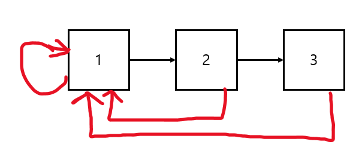
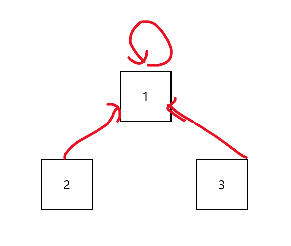
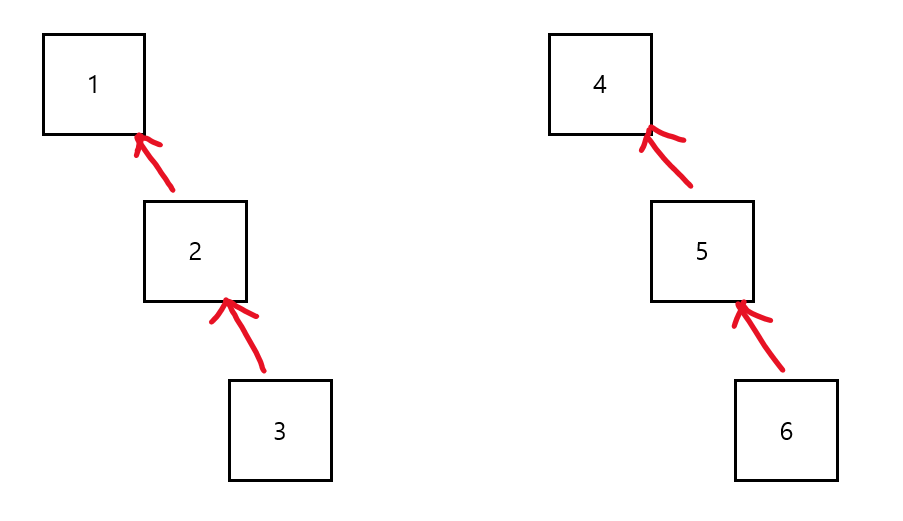
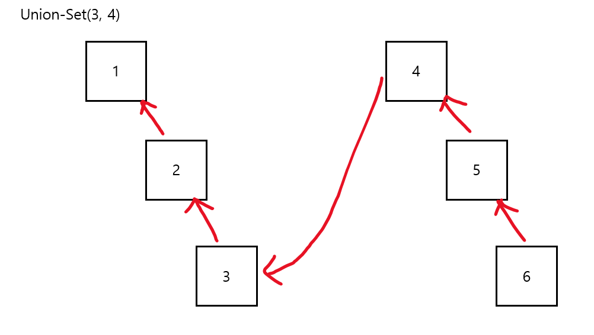
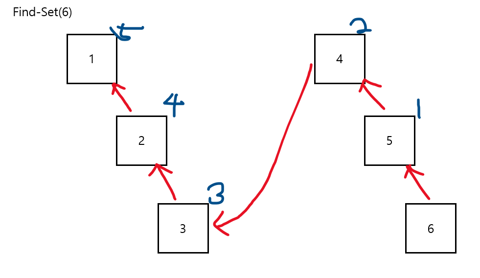
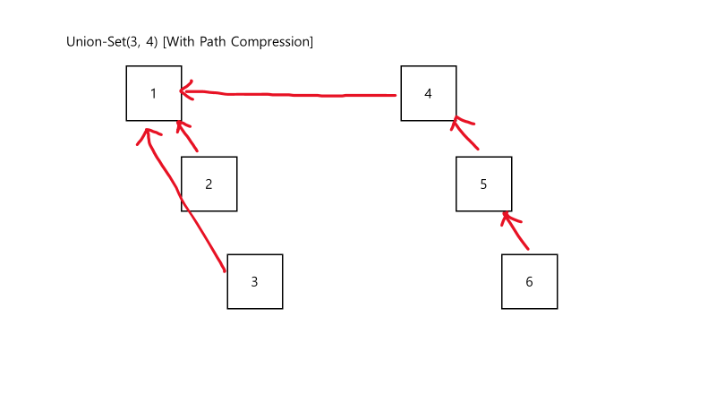
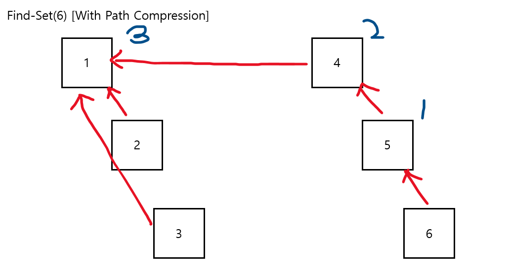
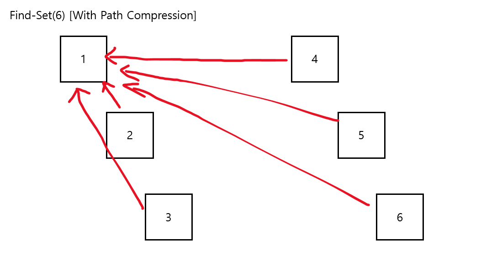

# [알고리즘] 서로소 집합 (Disjoint Set)

-   서로소 또는 상호 배타 집합들은 서로 중복 포함된 원소가 없는 집합들이다. 다시 말해 교집합이 없다.
-   집합에 속한 하나의 특정 멤버를 통해 각 집합들을 구분한다. 이를 **대표자**라고 한다.
-   서로소 집합을 표현하는 방법
    -   연결 리스트
    -   트리
-   서로소 집합 연산
    -   Make-Set(x): x로 이루어진 최소 단위 집합 생성(A,B,C 각 하나만 들어있는 집합)
    -   Find-Set(x): x가 속한 집합 찾기 = x가 속한 대표자 찾기
    -   Union(x, y): x가 속한 집합과 y가 속한 집합을 합쳐 하나의 집합으로 만듦 → 서로소 집합을 유지

## 서로소 집합 표현 - 연결 리스트

-   같은 집합의 원소들은 하나의 연결 리스트로 관리한다.
-   연결 리스트의 맨 앞의 원소를 집합의 대표 원소로 삼는다.
-   각 원소는 집합의 대표 원소를 가리키는 링크를 갖는다.



### 서로소 집합 표현 - 트리

-   같은 집합의 원소들을 하나의 트리로 표현한다.
-   자식 노드가 부모 노드를 가리키며 루트 노드가 대표자가 된다.



### 서로소 집합 연산 (트리)

-   Make-Set(x): x로 이루어진 최소 단위 집합 생성(A,B,C 각 하나만 들어있는 집합)

```java
void makeSet(int[] arr, int x) {
    arr[x] = x;
}
```

-   Find-Set(x): x가 속한 집합 찾기 = x가 속한 대표자 찾기

```java
int findSet(int[] arr, int x) { 
    if (arr[x] == x) { 
        return x; 
    } 
    return findSet(arr[x]);
}
```

-   Union(x, y): x가 속한 집합과 y가 속한 집합을 합쳐 하나의 집합으로 만듦 → 서로소 집합을 유지

```java
boolean unionSet(int[] arr, int x, int y) {
    int rootX = findSet(arr, x);
    int rootY = findSet(arr, y);
    if (rootX == rootY) {
            return false;
    }

    arr[rootY] = rootX;
    return true;
}
```

### 연산의 효율을 높이는 방법

-   Rank를 이용한 Union
    -   각 노드는 자신을 루트로 하는 subTree의 높이를 rank로 저장한다.
    -   두 집합을 Union할 때, rank가 낮은 집합을 rank가 높은 집합에 Union시킨다.
-   Path Compression
    -   Find-Set을 행하는 과정에서 만나는 모든 노드들에 대하여 root를 가르키도록 바꿔준다.따라서, Find-Set할 때, 모두 root 노드를 바라보도록 변경해주면 경로를 압축하는 효과를 얻을 수 있다.
    -   즉, 루트에 subTree를 계속 달면 트리의 depth가 길어져 탐색 과정에서 시간 효율이 떨어진다.

Path Compression을 이용한 방법을 알아보자.

---

아래와 같이 두 개의 서로소 집합이 있다고 하자.



### Path Compression 적용 X

Union-Set(3, 4)를 하면 아래와 같이 될 것이고,




Find-Set(6)을 하면 5번을 거쳐야 root 노드를 찾을 수 있다.




---

### Path Compression 적용 O

Path Compression을 적용하면 Union 과정에서 FindSet를 호출하여 부모 노드를 찾고, 부모 노드를 갱신해주는 작업을 거치게 되므로 Union 결과는 아래와 같다.




마찬가지로 FindSet(6)을 하게 되면 Path Compression을 적용하기 전과 다르게 연산 횟수가 3으로 줄었다. 이 때, FindSet(6)하는 과정에서 다시 부모 노드를 갱신하게 된다.



따라서, 최종 결과는 아래와 같아진다.



---

### 서로소 집합 연산 (트리, Path Compression)

-   Make-Set(x): 위와 동일
-   Find-Set(x)
    
    ```
    int findSet(int[] arr, int x) {
        if (arr[x] == x) {
                return x;
        }
        // return findSet(arr[x]); // Path-Compression 미적용
        return arr[x] = findSet(arr[x]); // Path-Compression 적용
    }
    ```
    
     

-   Union(x, y): 위와 동일