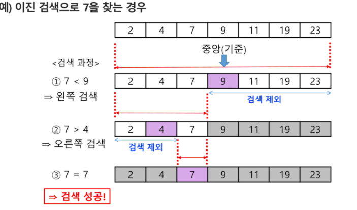
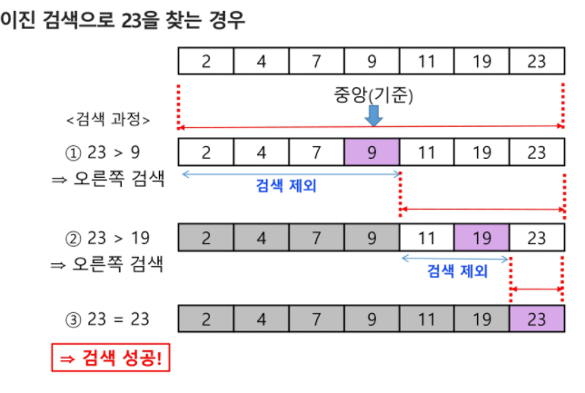

# [알고리즘] 이진 탐색 (binary search)

## 이진 탐색이란?

- 탐색 과정 (자료가 오름차순으로 정렬되어 있다고 가정)
1. 배열의 중앙에 있는 원소를 고른다.
2. 중앙의 원소 값과 찾고자 하는 목표 값을 비교한다.
3. 만약, 일치하면 종료
4. 목표 값이 중앙의 원소 값보다 작으면 자료의 왼쪽 반에 대해서 다시 탐색을 시작하고, 크다면 오른쪽 반에 대해서 탐색을 시작한다.
5. 목표 값을 찾을 때까지 위 과정을 반복한다.




- 구현 (반복문)
    
```java
int binarySearch(int[] arr, int n, int value) {
    int left = 0;
    int right = n - 1;

    while (left <= right) {
        int mid = (left + right) / 2;
        if (arr[mid] == value) {
            return mid;
        } else if (arr[mid] < value) {
            left = mid + 1;
        } else {
            right = mid - 1;
        }
    }
    return -1;
}
```
    
- 구현 (재귀)

```java
int binarySearch(int[] arr, int left, int right, int value) {
    if (right < left) {
        return -1;
    }


    int mid = (left + right) / 2;
    if (arr[mid] == value) {
        return mid;
    } else if (arr[mid] < value) {
        return binarySearch(arr, mid + 1, right, value);
    } else {
        return binarySearch(arr, left, mid - 1, value);
    }
}
```

## lower bound

- lower bound는 특정 value 값과 같거나 큰 값이 처음으로 나오는 index를 반환한다.

```java
int binarySearch(int[] arr, int left, int right, int value) {
    if (right <= left) {
        return right;
    }


    int mid = (left + right) / 2;
    if (arr[mid] < value) {
        return binarySearch(arr, mid + 1, right, value);
    } else {
        return binarySearch(arr, left, mid, value);
    }
}
```

## upper bound

- upper bound는 특정 value 값보다 큰 값이 처음으로 나오는 index를 반환한다.

```java
int binarySearch(int[] arr, int left, int right, int value) {
    if (right <= left) {
        return right;
    }


    int mid = (left + right) / 2;
    if (arr[mid] <= value) {
        return binarySearch(arr, mid + 1, right, value);
    } else {
        return binarySearch(arr, left, mid, value);
    }
}
```