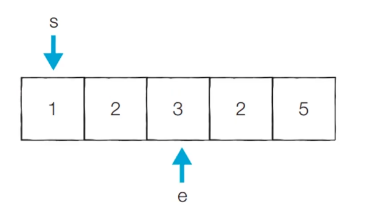

# [알고리즘] 투포인터 (Two Pointers)

## 투포인터란?

- 리스트/배열에서 두 개의 점의 위치를 기록하면서 처리하는 알고리즘

## 예제 - 동일한 합을 가지는 부분 연속 수열 찾기

- 숫자들의 배열이 주어질 때, 연속 수열의 합이 특정 값을 가지는 것을 확인하는 예제
- 아래와 같은 순서로 풀 수 있다.

1. 시작점 left와 끝점 right가 첫번째 인덱스를 가리키도록 한다.
2. 부분 합이 M과 같다면 카운트한다.
3. 현재 부분 합이 M보다 작다면 right를 1 증가시킨다.
4. 현재 부분 합이 M보다 크거나 같다면 left를 1 증가시킨다.
5. 모든 경우를 확인할 때까지 2-4번 과정을 반복한다.

아래와 같은 배열이 있다고 하자.

이 배열에서 부분 연속 수열의 합이 5가 되는 경우를 생각해보자.

부분 합: 1

카운트: 0

부분 합: 3

카운트: 0

부분 합: 6

카운트 : 0

부분 합: 5

카운트: 1

[... 반복]

부분합: 5

카운트: 3