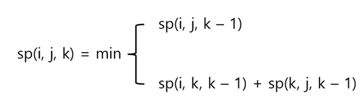
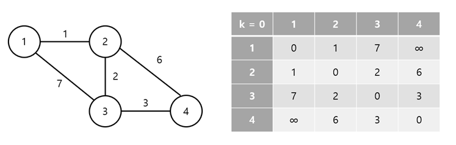
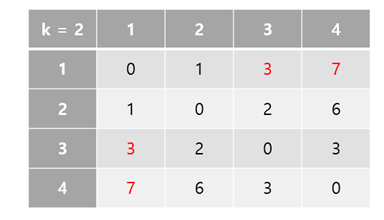
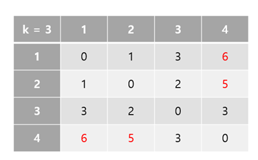

# [알고리즘] 플로이드 워셜 (Floyd-Warshall)

## 플로이드 워셜 알고리즘이란?

-   그래프의 모든 쌍에 대하여 최단 거리를 찾는 알고리즘!
-   앞서 언급한 다익스트라는 어떠한 시작 노드에서 최단 거리를 찾는 거라면, 플로이드 워셜은 모든 노드 쌍에 대하여 최단 거리를 찾는 알고리즘이다.

## 복잡도

-   시간 복잡도: O(N^3)
-   공간 복잡도: O(N^2)

## 기본 공식



sp(i, j, k)는 i에서 j를 갈 때, k를 거쳐서 가도 될 때의 최단 거리라는 뜻이다.

## 예

공식으로 보면 무슨 말인지 잘 이해가 되지 않으니, 예를 들어서 설명해보자!




왼쪽과 같은 그래프가 있다고 하자. 오른쪽 표는 그래프를 인접행렬로 나타낸 것이자 k = 0일 때의 초기 상태다.

## \# k = 1

1번 노드를 거쳐서 갈 수 있다고 해보자.

위 그래프에선 1번 노드가 가장 자리에 있어 거쳐서 가도 이득이 발생하지 않는다.

따라서 위 표에도 변화가 없다.


## \# k = 2

2번 노드를 거쳐 갈 수 있다고 해보자.




sp\[1\]\[3\] = min(sp\[1\]\[3\], sp\[1\]\[2\] + sp\[2\]\[1\]) = min(7, 1 + 2) = 3

sp\[1\]\[4\] = min(sp\[1\]\[4\], sp\[1\]\[2\] + sp\[2\]\[4\]) = min(∞, 1 + 6) = 7

이 성립하여 변화가 생겼다.

## \# k = 3




sp\[1\]\[4\] = min(sp\[1\]\[4\], sp\[1\]\[3\] + sp\[3\]\[4\]) = min(7, 3 + 3) = 6

sp\[2\]\[4\] = min(sp\[2\]\[4\], sp\[2\]\[3\] + sp\[3\]\[4\]) = min(6, 2 + 3) = 5

## \# k = 4

4번 노드 역시 1번 노드와 마찬가지로 구석에 있어 변화가 없다.

---

위 예를 코드로 작성해보자.

## 코드

```kotlin
import kotlin.math.min

val graph = arrayOf(
    intArrayOf(0, 1, 7, Int.MAX_VALUE),
    intArrayOf(1, 0, 2, 6),
    intArrayOf(7, 2, 0, 3),
    intArrayOf(Int.MAX_VALUE, 6, 3, 0)
)

fun main() {
    printGraph(0)
    floydWarshall()
}

fun floydWarshall() {
    for (k in 0 until 4) {
        for (r in 0 until 4) {
            for (c in 0 until 4) {
                if (graph[r][k] != Int.MAX_VALUE && graph[k][c] != Int.MAX_VALUE) {
                    graph[r][c] = min(graph[r][c], graph[r][k] + graph[k][c])
                }
            }
        }
        printGraph(k + 1)
    }
}

fun printGraph(k: Int) {
    println("### k: $k ###")
    for (r in 0 until 4) {
        for (c in 0 until 4) {
            print("${graph[r][c]} ")
        }
        println()
    }
    println()
}
view raw
```

## 실행 결과

```
### k: 0 ###
0 1 7 2147483647 
1 0 2 6 
7 2 0 3 
2147483647 6 3 0 

### k: 1 ###
0 1 7 2147483647 
1 0 2 6 
7 2 0 3 
2147483647 6 3 0 

### k: 2 ###
0 1 3 7 
1 0 2 6 
3 2 0 3 
7 6 3 0 

### k: 3 ###
0 1 3 6 
1 0 2 5 
3 2 0 3 
6 5 3 0 

### k: 4 ###
0 1 3 6 
1 0 2 5 
3 2 0 3 
6 5 3 0
```