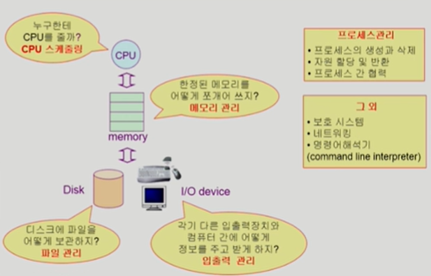
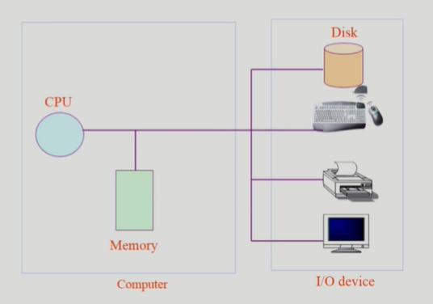
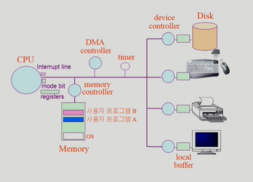

# [운영체제] 구조

## 운영체제의 구조

- CPU 스케쥴링

    마치 동사무소에서 업무를 보는 방식. 접수처에 줄을 서고, 한명 한명 요청 업무를 처리하는데, 먼저 온 사람의 업무 처리 시간이 1시간 소요되고, 나머지 사람들이 1분 씩 소요된다고 가정했을 때, 비록 늦게 왔어도 처리 짧은 뒷 사람부터 업무를 처리한다면 전체적인 성능이 향상된다. 

    CPU 스케쥴링도 이러한 메커니즘으로 순서, 처리 속도 등을 고려해 성능을 향상시킬 수 있는 방향으로 업무 처리 순서를 정함.

    보통 여러 프로세스가 골고루 간헐적으로 CPU를 점유하면서 마치 동시에 동작하는 것처럼 처리된다고 함.

- 파일 관리

    DISK 에서 값을 읽을 땐, HEAD라는 녀석이 물리적으로 이동하면서 값을 읽어내는데, 마치 엘레베이터의 처리와 유사하다. 먼저 온 사람이 1층에서 100층을 가고, 그 다음 사람이 2층에서 99층을 간다고 할 때, 최적의 성능을 내기 위해선 1번째 온 사람이 희생해 2번째 온 사람을 태우고 가야할 것이다.

    DISK 관리도 마찬가지로 물리적 이동을 할 때에 최적의 성능을 내기 위해 스케쥴링하는 것이다. 

## 컴퓨터 시스템 구조

DISK는 메모리보다 100만배 느리다.

CPU는 쉴 틈 없이 일한다. 예를 들어 키보드 INPUT 요청을 기다릴 때, 다른 프로그램에 CPU를 할당시켜 최대 효율을 낸다.

interrupt line: CPU는 모든 주변 기기와 데이터와 신호를 주고 받으며 보드에서 일어나는 모든 일을 관장한다. 이 때, 주변 기기에서 CPU 점유 요청을 할 때, interrupt line을 통해 요청을 한다. 

tImer: 프로그램이 CPU를 점유할 때, 점유하는 시간을 기록해 OS가 CPU를 회수할 수 있도록 함.

mode bit: CPU가 OS에 할당되었는지, 프로그램에 할당되었는지 기록. 이를 통해 CPU의 권한을 조절한다. (프로그램은 최소한의 권한을, OS에겐 풀 권한을)

device controller

    - I/O 장치를 관리하는 일종의 작은 CPU.
    - 제어 정보를 위해 control register, status register를 가짐.
    - local buffer를 가짐. (일종의 data register)
    - I/O는 실제 device와 local buffer 사이에서 일어남. I/O가 끝났을 때, interrupt로 CPU에게 알림.

DMA controller: I/O controller에서 작업 후, local buffer에 담긴 data를 메모리에 쓰는 역할.

## 입출력(I/O)의 수행

- 모든 입풀력 명령은 특권 명령.
- 시스템 콜(system call): 사용자 프로그램이 운영체제의 서비스를 받기 위해 커널 함수를 호출하는 것.
- trap을 사용하여 interrupt 벡터의 특정 위치로 이동.

## Interrupt

- 현대의 운영체제는 interrupt에 의해 구동된다.
- interrupt 당한 시점의 레지스터와 program counter를 저장한 후 CPU의 제저를 interrupt 처리 루틴에 넘긴다.

- 하드웨어 interrupt: 하드웨어가 발생시킨 interrupt.
- trap (소프트웨어 interrupt)
    - Exception: 프로그램이 오류를 범한 경우.
    - System call: 프로그램이 커널 함수를 호출하는 경우.
- interrupt 벡터: 해당 interrupt의 처리 루틴 주소를 가지고 있음.
- interrupt 처리 루틴: 해당 interrupt를 처리하는 커널 함수.
