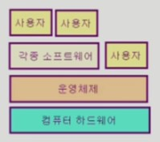

# [운영체제] 개요

## 운영체제(Operating System, OS)란?

컴퓨터 하드웨어 바로 위에 설치되어 사용자 및 다른 모든 소프트웨어와 하드웨어를 연결하는 소프트웨어 계층

사용자가 하드웨어를 몰라도 쉽게 사용할 수 있게 해주는 중간 역할

- 협의의 운영체제 = 커널
    
    운영체제의 핵심 부분으로 메모리에 상주하는 부분

- 광의의 운영체제

    커털 뿐만 아니라 각종 주변 시스템 유틸리티를 포함하는 개념

## 운영체제의 목표

1. 컴퓨터 시스템을 **편리하게 사용할 수 있는 환경**을 제공

    - 운영체제는 동시 사용자/프로그램들이 각각 독자적 컴퓨터에서 수행되는 것 같은 환상을 제공
    - 하드웨어를 직접 다루는 복잡한 부분을 운영체제가 대행

2. 컴퓨터 시스템의 **자원을 효율적으로 관리**

    - 프로세서, 기억 장치, 입출력 장치 등의 효율적 관리
    - 사용자 간의 형평성 있는 자원 분배. 주어진 자원으로 최고의 효율을 내기 위함.
    - 사용자 및 운영체제 보호
    - 프로세스, 파일, 메시지 등을 관리

## 운영체제의 분류

1. 동시 작업 가능 여부

    - 단일 작업 (single tasking)

        한 번에 하나의 작업만 처리

        예) **MS-DOS** 프롬프트 상에서는 한 명령의 수행을 끝내기 전에 다른 명령을 수행할 수 없었음.

    - 다중 작업 (multi tasking)

        동시에 두 개 이상의 작업 처리

        예) **UNIX**, **MS Windows** 등에서는 한 명령의 수행이 끝나기 전에 다른 명령이나 프로그램을 수행할 수 있음.

2. 사용자의 수

    - 단일 사용자 (single user)

        예) **MS-DOS**, **MS-Windows**

    - 다중 사용자 (multi user)

        예) **UNIX**, **NT server**

3. 처리 방식

    - 일괄 처리 (batch processing)

        작업 요청의 일정량 모아서 한꺼번에 처리

        작업이 완전 종료될 때까지 기다려야 함.

    - 시분할 (time sharing)

        여러 작업을 수행할 때 컴퓨터 처리 능력을 일정한 시간 단위로 분할하여 사용

        일괄 처리 시스템에 비해 짧은 응답 시간을 가짐

    - 실시간 (realtime OS)

        정해진 시간 안에 어떠한 일이 반드시 종료됨이 보장되어야 하는 실시간 시스템을 위한 OS

## 용어 정리

컴퓨터에서 여러 작업을 동시에 수행하는 것을 뜻한다.

- Multi tasking
- Multi programming: 여러 프로그램이 메모리에 올라가 있음을 강조
- Time sharing: CPU의 시간을 분할하여 나누어 쓴다는 의미를 강조
- Multi process
---
- Multi processor: 하나의 컴퓨터에 CPU가 여러 개 붙어 있음을 의미

## 운영체제의 예

1. 유닉스 (UNIX)

    코드의 대부분을 C언어로 작성 (유닉스를 만들기 위해 C언어가 탄생)

    높은 이식성

    최소한의 커널 구조

    복잡한 시스템에 맞게 확장 용이

    소스 코드 공개

    프로그램 개발에 용이

2. DOS

    단일 사용자용 운영체제, 메모리 관리 능력의 한계 (주 기억 장치: 640KB)

3. Windows

    다중 작업용 GUI 기반 운영 체제