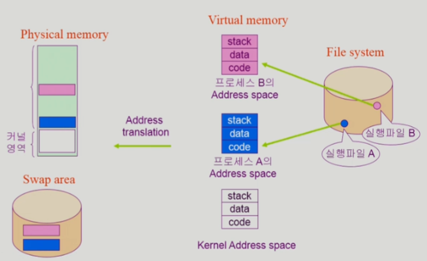
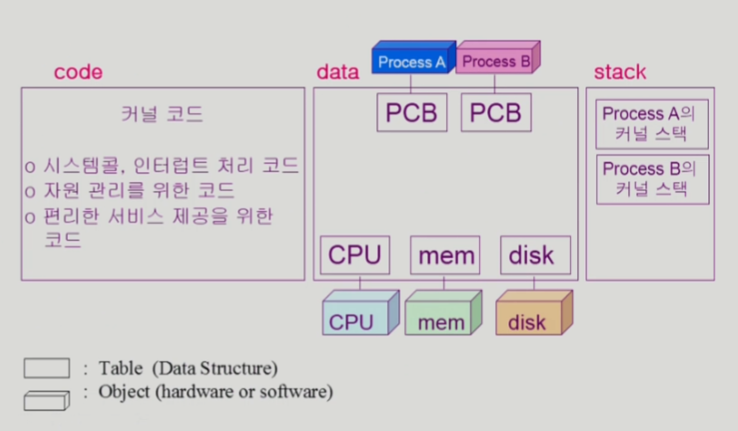
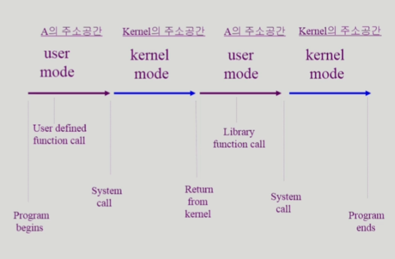

# [운영체제] 프로그램의 실행

- Disk 에 영구히 저장된 프로그램을 실행하면 프로세스의 virtual memory 공간이 생성됨.
    - code: 프로세스에서 사용하는 코드 저장 공간
    - data: 프로세스에서 사용하는 변수 저장 공간
    - stack: 프로세스에서 함수 호출의 스택

- 프로세스의 주소 공간은 메모리와 디스크(Swap area)에 분산되어 저장됨.

## 커널 주소 공간의 내용

## 프로그램이 사용하는 함수

- 사용자 정의 함수 => 프로세스 가상 메모리의 `code` 단에 존재

    - 자신의 프로그램에서 정의한 함수

- 라이브러리 함수 => 프로세스 가상 메모리의 `code` 단에 존재

    - 자신의 프로그램에서 정의하지 않고 갖다 쓴 함수
    - 자신의 프로그램 실행 파일에 포함되어 있음.

- 커널 함수 => 커널 가상 메모리의 `code` 단에 존재

    - 운영체제 프로그램의 함수
    - 커널 함수의 호출 = `시스템 콜`

