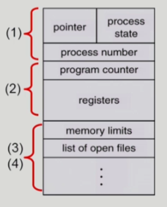

# [운영체제] 프로세스

## 프로세스의 개념

- 프로세스의 문맥 (context)

    - CPU 수행 상태를 나타내는 하드웨어 문맥
        - Program Counter
        - 각종 register

    - 프로세스의 주소 공간
        - code, data, stack
    
    - 프로세스 관련 커널 자료 구조
        - PCB (Process control block)
        - kernel stack

## 프로세스의 상태

- 프로세스는 상태(State)가 변경되며 수행된다.

    - Running
        - CPU를 잡고 instruction을 수행중인 상태
    
    - Ready
        - CPU를 기다리는 상태 (메모리 등 다른 조건을 모두 만족한 상태)
    
    - Blocked (wait, sleep)
        - CPU를 주어도 당장 instruction을 수행할 수 없는 상태
        - 프로세스 자신이 요청한 event(I/O)가 완료되지 않아 기다리는 상태 (예. 디스크에서 파일을 읽어와야 하는 경우)

    - Suspended (stopped)
        - 외부적인 이유로 프로세스의 수행이 정지된 상태
        - 프로세스는 통째로 디스크에 swap out된다. (예. 메모리에 너무 많은 프로세스가 올라와 있을 때, 사용자가 프로그램을 중지시켰을 때)

    - New: 프로세스가 생성중인 상태

    - Terminated: 수행이 끝난 상태

## Process Control Block (PCB)

- 운영체제가 각 프로세스를 관리하기 위해 프로세스 당 유지하는 정보
- 다음 구성 요소를 가진다.

    - 1. OS가 관리 상 사용하는 정보
        - 프로세스 상태, 프로세스 ID
        - scheduling information, priorty

    - 2. CPU 수행 관련 하드웨어 값
        - Program Counter, registers

    - 3. 메모리 관련
        - code, data, stack

    - 4. 파일 관련
        -Open file descriptors...

## Context switch (문맥 교환)

- CPU를 한 프로세스에서 다른 프로세스로 넘겨주는 과정
- CPU가 다른 프로세스에게 넘어갈 때 운영체제는 다음을 수행
    - CPU를 내어주는 프로세스의 상태를 그 프로세스의 PCB에 저장
    - CPU를 새롭게 얻는 프로세스의 상태를 PCB에서 읽어옴

- System call이나 Interrupt 발생 시 반드시 Context switch가 일어나는 것은 아님

## 프로세스를 스케쥴링하기 위한 큐

- 프로세스는 각 큐를 오가며 수행된다

    - Job queue
        - 현재 시스템 내에 있는 모든 프로세스의 집합

    - Ready queue
        - 현재 메모리 내에 있으면서 CPU를 잡아서 실행되기를 기다리는 프로세스의 집합

    - Device queue
        - I/O device의 처리를 기다리는 프로세스의 집합

## Scheduler (스케쥴러)

- Long-term scheduler (장기 스케쥴러 or job scheduler)
    - 시작 프로세스 중 어떤 것들을 ready queue에 보낼 지 결정
    - 프로세스에 `memory`를 주는 문제
    - 메모리에 올라갈 프로세스의 수를 제어
    - time sharing system에는 보통 장기 스케쥴러가 없음 (무조건 ready)

- short-term scheduler (단기 스케쥴러 or CPU scheduler)
    - 어떤 프로세스를 다음번에 running 시킬 지 결정
    - 프로세스에 `CPU`를 주는 문제

- medium-term scheduler (중기 스케쥴러 or Swapper)
    - 여유 공간 마련을 위해 프로세스를 통째로 메모리에서 디스크로 쫓아냄
    - 프로세스에게서 `memory`를 뺏는 문제
    - 메모리에 올라갈 프로세스의 수를 제어

