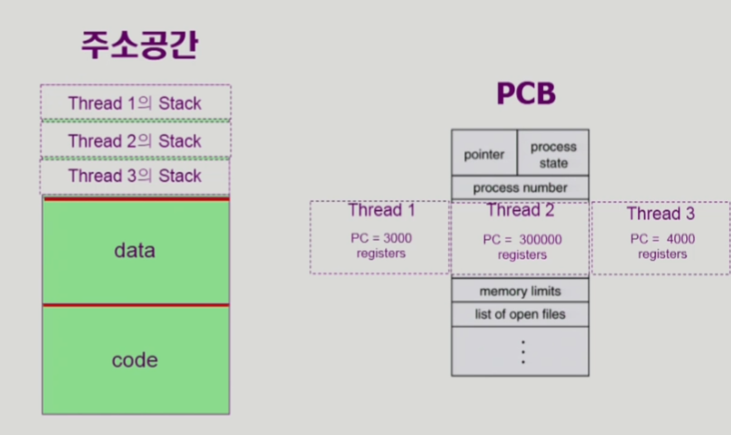
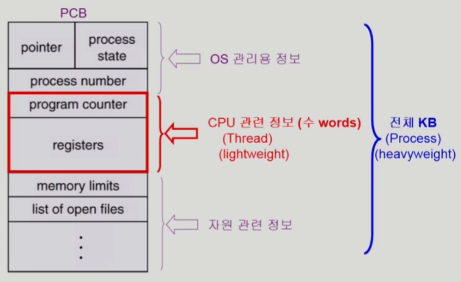

# [운영체제] 스레드

## 스레드란? (Thread)

- 어떠한 프로그램 또는 프로세스 내에서 실행되는 CPU 흐름의 단위
- 스레드의 구성
    - program counter
    - register set
    - stack space
- 스레드가 동료 쓰레드와 공유하는 부분
    - code section
    - data section
    - OS resources
- 전통적인 개념의 heavyweight process는 하나의 스레드를 가지고 있는 task로 볼 수 있다.
- 프로세스에서 PC를 여러 개 두어, 흐름을 여러 개 둔다. 이것이 스레드.

## 스레드의 장점

1. 응답성 (Responsiveness)
    - 다중 스레드로 구성된 task 구조에서는 하나의 서버 스레드가 blocked (waiting) 상태인 동안에도 동일한 task 내의 다른 스레드가 실행(running)되어 빠른 처리를 할 수 있다.
2. 자원 공유 (Resource Sharing)
    - 메모리 영역을 공유하기 때문에 자원 절약을 할 수 있다.
3. 경제성 (Economy)
    - 프로세스를 하나 만들고, Context switch를 하는 행위는 overhead가 크다. 하지만 스레드 간 switch는 가볍기 때문에 경제적이다.
    - 동일한 일을 수행하는 다중 스레드가 협력하여 높은 처리율(throughput)과 성능 향상을 얻을 수 있다.
4. 다중 CPU에서의 효율 (Utilization of Multi Processor Architectures)
    - 스레드를 사용하면 병렬성을 높일 수 있다.

## 스레드의 구현

- 커널 스레드
    - 운영체제 내에서 스레드를 지원.
- 유저 스레드
    - 라이브러리에서 지원하는 스레드. 사용자 단에서 스레드를 구현한 방식.

