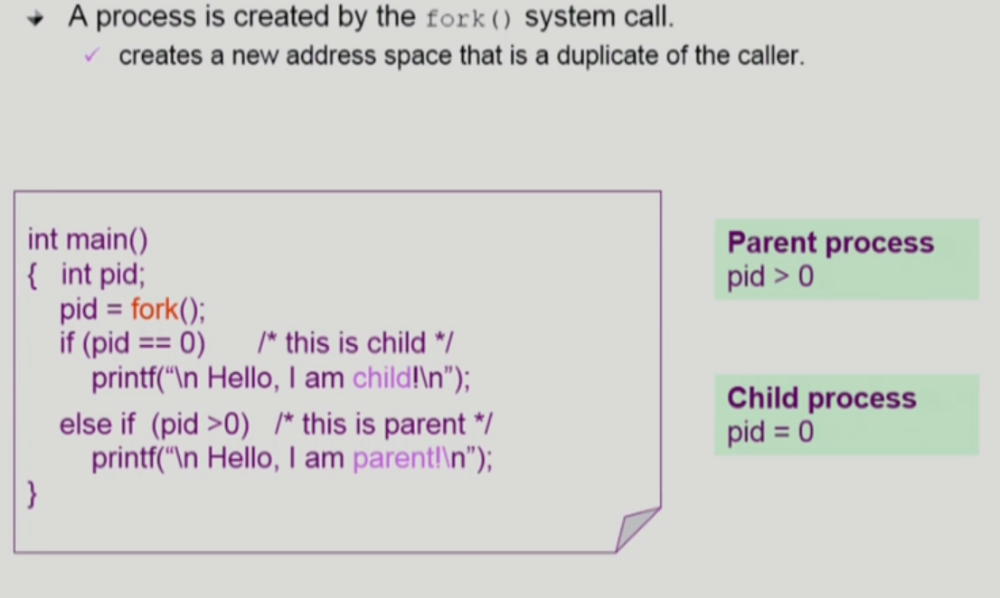
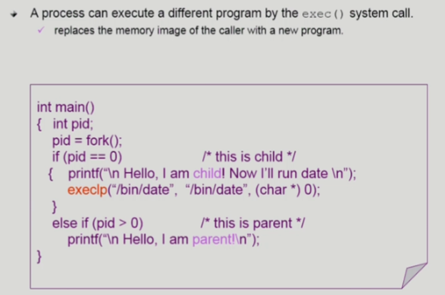
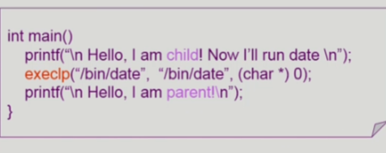
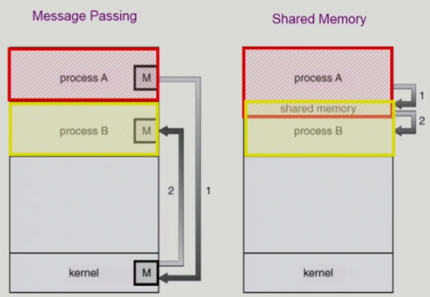
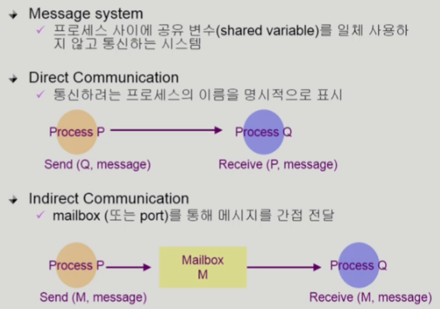

# [운영체제] 프로세스 관리

## 프로세스 생성 (Process Creation)

- 부모 프로세스가 자식 프로세스를 생성
- 프로세스의 트리 형성
- 프로세스는 자원을 필요로 함
    - 운영체제로부터 받는다.
    - 부모와 공유한다.
- 자원의 공유
    - 부모와 자식이 모든 자원을 공유하는 모델
    - 일부를 공유하는 모델
    - 전혀 공유하지 않는 모델
- 수행 (Excution)
    - 부모와 자식은 공존하며 수행되는 모델
    - 자식이 종료될 때까지 부모가 기다리는 모델
- 주소 공간 (Address space)
    - 자식은 부모의 공간을 복사함  (binary and OS data)
    - 자식은 그 공간에 새로운 프로그램을 올림
- 유닉스의 예
    - `fork()` 시스템 콜이 새로운 프로세스를 생성
        - 부모를 그대로 복사 (OS data except PID + binary)
    - `fork()` 다음에 이어지는 `exec()` 시스템 콜을 통해 새로운 프로그램을 메모리에 올림

## 프로세스 종료 (Process Termination)

- 프로세스가 마지막 명령을 수행한 후 운영체제에게 이를 알려줌 (`exit()`)
    - 자식이 부모에게 output data를 보냄 (via wait)
    - 프로세스의 각종 자원들이 운영체제에게 반납됨
- 부모 프로세스가 자식의 수행을 종료시킴 (abort)
- 자식에게 할당된 태스트가 더 이상 필요하지 않음
- 부모가 종료하는 경우
    - 운영체제는 부모 프로세스가 종료하는 경우 자식이 더 이상 수행되도록 두지 않는다.
    - 단계적인 종료

## 프로세스와 관련된 시스템 콜

- `fork()`: create a child (copy)
- `exec()`: overlay new image
- `wait()`: sleep until child is done
- `exit()`: frees all the resources, notify parent

## `fork()` 시스템 콜

- 부모 프로세스의 `fork()` 결과 값은 양수이고, 자식 프로세스의 결과값은 0이기 떄문에, 둘을 구별할 수 있다.

## `exec()` 시스템 콜

- `fork()`를 통해 부모 프로세스를 복사하고, `exec()`를 거쳐 새로운 프로세스를 덮어 씌운다.
- 프로세스의 생성을 최적화하기 위해 부모 것을 복사하고, 자식의 진짜 프로세스를 실행시키는 느낌?

- `exec()` 이후엔 원래 코드로 절대 돌아올 수 없다. (3번째줄 실행 X)

## `wait()` 시스템 콜

- 프로세스 A가 `wait()` 시스템 콜을 호출하면
    - 커널은 child가 종료될 때까지 프로세스 A를 sleep시킨다 (block 상태)
    - 자식 프로세스가 종료되면 커널은 프로세스 A를 깨운다 (ready 상태)

## `exit()` 시스템 콜

- 자발적 종료
    - 마지막 statement 수행 후, `exit()` 시스템 콜을 통해
    - 프로그램에 명시적으로 적어주지 않아도 main 함수가 리턴되는 위치에 컴파일러가 넣어줌
- 비자발적 종료
    - 부모 프로세스가 자식 프로세스를 강제 종료시킴
        - 자식 프로세스가 한계치를 넘어서는 자원 요청
        - 자식에게 할당된 태스크가 더 이상 필요하지 않음
    - 키보드로 kill, break 등을 한 경우
    - 부모가 종료되는 경우
        - 부모 프로세스가 종료하기 전에 자식들이 먼저 종료됨

## 프로세스 간 협력

- 독립적 프로세스 (Independent process)
    - 프로세스는 각자의 주소 공간을 가지고 수행되므로 원칙적으로 하나의 프로세스는 다른 프로세스의 수행에 영향을 미치지 못함
- 협력 프로세스 (Cooperating process)
    - 프로세스 협력 메커니즘을 통해 하나의 프로세스가 다른 프로세스의 수행에 영향을 미칠 수 있음
- 프로세스 간 협력 메커니즘(**IPC**: Interprocess Communication)
    

    - `message passing`: 커널의 통해 메시지 전달
        
    - `shared memory`: 주소 공간을 공유하는 방법