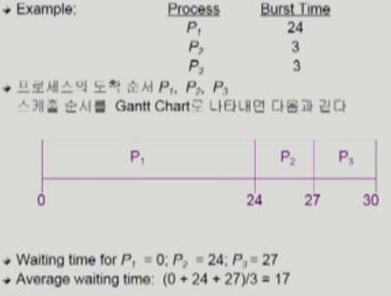
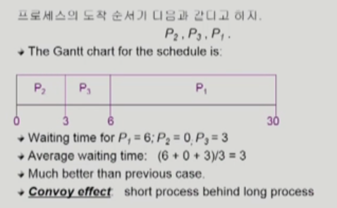
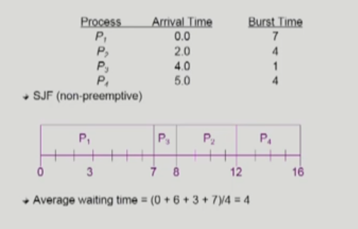
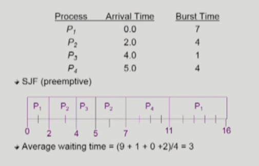
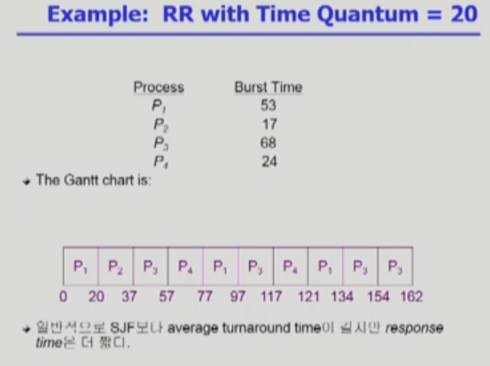

# [운영체제] CPU 스케줄링

## CPU Scheduler & Dispatcher

- CPU Scheduler
    - Ready 상태의 프로세스 중에서 이번에 CPU를 쓸 프로세스를 고른다
- Dispatcher
    - CPU 제어권을 CPU Scheduler에 의해 선택된 프로세스에게 넘긴다
    - 이 과정을 Context Switch (문맥 교환)이라고 한다

- CPU 스케줄링이 필요한 경우는 프로세스에게 다음과 같은 상태 변화가 있는 경우다.
    1. Running -> Blocked (예: I/O 요청하는 시스템 콜)
    2. Running -> Ready (예: 할당시간 만료로 timer interrupt)
    3. Blocked -> Ready (예: I/O 완료 후 interrupt)
    4. Terminate

비선점형 nonpreemptive (강제로 빼앗지 않는)
선점형 preemptive (강제로 뺴앗는)

## 성능 척도 (Performance Index)

- CPU utilization (이용률)
    - keep the CPU as busy as possible
    - 요리사가 근무 시간 대비 일하는 시간
- Throughput (처리량)
    - @ of processes that complete their excution per time unit
    - 손님 수
- Turnaround time (소요 시간)
    - amount of time to execute a particular process
    - 손님이 주문을 하고, 다 먹고 나갈 때까지의 시간
- Waiting time (대기 시간)
    - amount of time a process has been waiting in the ready queue
    - 손님이 음식이 나올 때까지 기다린 시간 (총 기다린 시간)
- Response time (응답 시간)
    - amount of time it takes from when a request was submitted until the first response is produced. not output
    - 손님이 주문을 하고 음식이 나올때까지 기다린 시간

CPU 관점에서 보는 것이기 때문에, 하나의 프로세스가 완전히 종료되는 것을 말하는 것이 아닌 interrupt 등 하나의 프로세스가 CPU를 점유하는 그 단위를 기준으로 한다.

## FCFS (First-Come First-Served)

비선점형 (nonpreemptive)

앞에 어떤 프로세스가 오는 가에 따라 성능이 좌우됨.

## SJF (Shortest-Job-First)

- 각 프로세스의 다음번 CPU burst time을 가지고 스케줄링에 활용
- CPU burst time이 가장 짧은 프로세스를 제일 먼저 스케줄
- Two schemes
    - Nonpreemptive
        - 일단 CPU를 잡으면 이번 CPU burst가 완료될 때까지 CPU를 선점당하지 않음
    - preemptive
        - 현재 수행 중인 프로세스의 남은 burst time보다 더 짧은 CPU burst time을 가지는 새로운 프로세스가 도착하면 CPU를 빼앗김
        - 이 방법을 SRTF (Shortest-Remaining-Time-First)라고도 부른다.
- SJF (preemptive) is optimal
    - 주어진 프로세스들에 대해 minimun average waiting time을 보장

- SJF (nonpreemptive)
    

- SJF (preemptive)
    

- 문제점
    - Starvation (기아 현상): CPU burst time이 긴 프로세스는 영원히 기다려야할 수 있음
    - CPU burst time을 정확히 예측할 수 없어서 추청하여 사용

## Priority Scheduling

- A priority number is associated with each process
- highest priority를 가진 프로세스에게 CPU 할당
- SJF는 일종의 priority scheduling -> priority = predicted next CPU burst time
- 문제점
    - Starvation (기아 현상): low priorty 를 가진 프로세스는 영원히 기다려야할 수 있음
- 해결법
    - Aging: ag time progresses increase the priority of the process

## Round Robin (RR)

- 요즘 스케줄링의 기반
- 각 프로세스는 동일한 크기의 할당 시간(time quantum)을 가짐 (일반적으로 10~100 ms)
- 할당 시간이 지나면 프로세스는 선점당하고, 다른 프로세스에게 CPU를 넘기고, 제일 뒤에 가서 기다린다
- n개의 프로세스가 ready queue에 있고, 할당 시간이 q time unit인 경우 각 프로세느느 최대 q time unit 단위로 CPU 시간의 1/n을 얻는다
- 어떤 프로세스도 (n - 1)q time unit 이상 기다리지 않는다
- 장점
    - 모든 프로세스에게 골고루
    - 굳이 예측하지 않아도 됨
- 성능
    - q lager -> FCFS
    - q small -> context switch 오버헤드가 커진다

