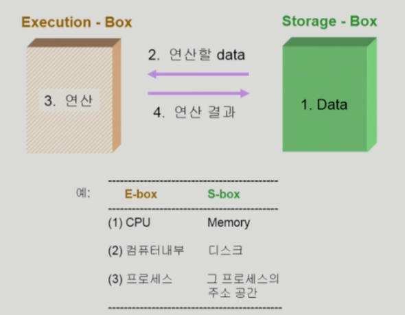
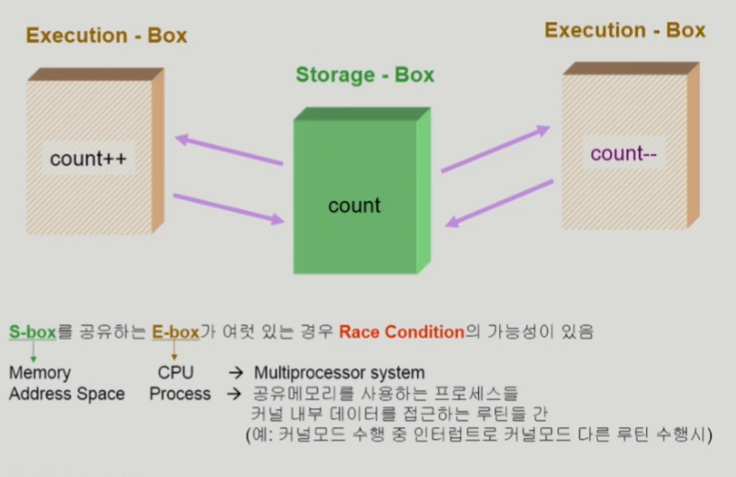
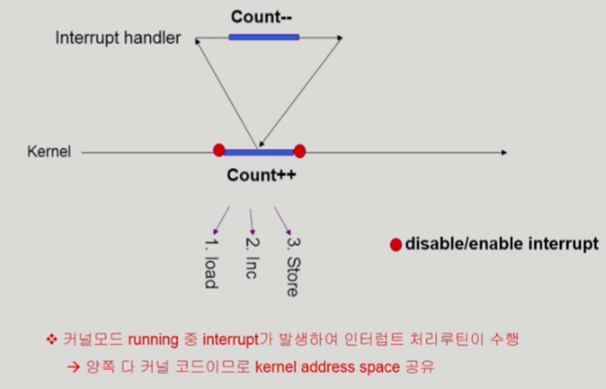
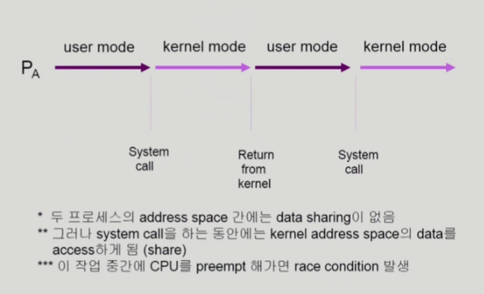
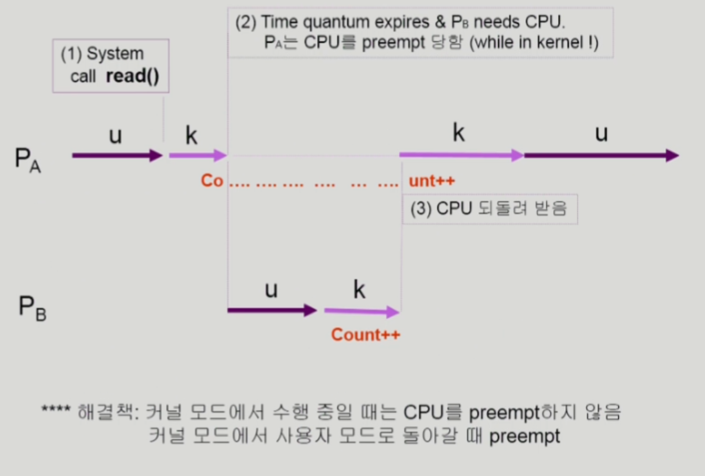
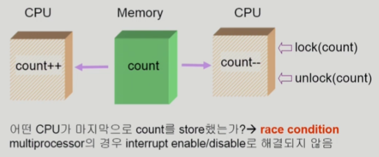

# [운영체제] Process Synchronization

## Process Synchronization 문제

- shared data의 동시 접근은 데이터의 불일치를 야기할 수 있다.
- 일관성을 유지하기 위해선 협력 프로세스간의 실행 순서를 정해주는 메커니즘이 필요

## 데이터 접근

## Race Condition

- 여러 프로세스들이 동시에 shared data에 접근하는 상황
- 데이터의 최종 연산 결과는 마지막에 그 데이터를 다룬 프로세스에 따라 달라짐

- race condition을 막기 위해서는 concurrent process는 동기화되어야 한다.

## OS에서 Race Condition은 언제 발생하고 어떻게 해결하는가?

1. 커널 수행 중 인터럽트 발생 시
    - 해결법: 데이터를 읽어 레지스터에 불러오고, 연산을 한 후, 다시 데이터를 쓸 때까지 인터럽트를 무시

    

2. 프로세스가 system call을 하여 커널 모드로 수행 중인데 context switch가 일어나는 경우
    - 해결법: 커널 모드에서 수행 중일 때는 CPU를 preempt하지 않는다.

    

    

3. Multi-processor에서 shared memory 내의 커널 데이터를 변경할 때

    - 해결법1. 한 번에 하나의 CPU만 커널 모드로 변경하도록 한다.
    - 해결법2. 커널 내부에 있는 각 공유 데이터에 접근할 때, lock한다.

    

## The Critical-Section Problem

- Critical-Section 이란 -> 공유 데이터를 접근하는 코드

- n개의 프로세스가 공유 데이터를 동시에 사용하기를 원하는 경우
- 각 프로세스의 code segment에는 공유 데이터를 접근하는 코드인 critical section이 존재
- 해결법: 하나의 프로세스가 critical section에 있을 때, 다른 모든 프로세스는 critical section에 들어갈 수 없어야 한다.