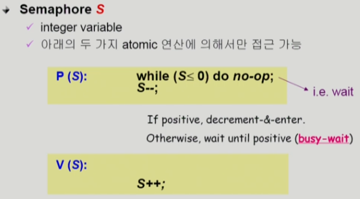
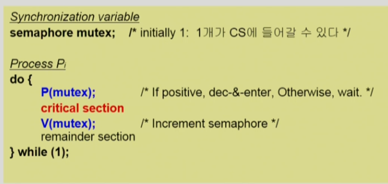
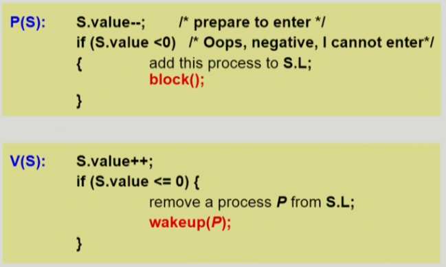
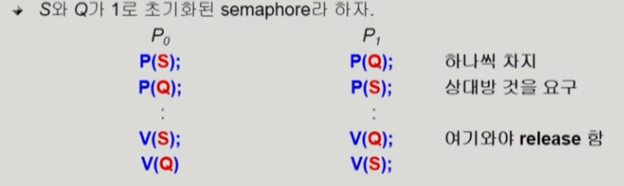
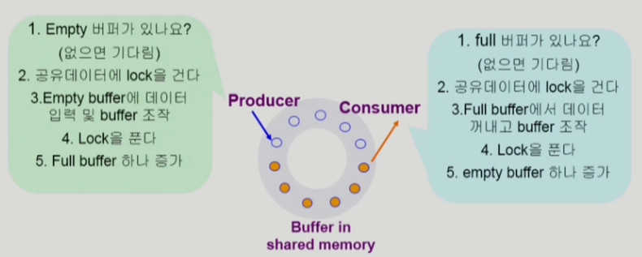
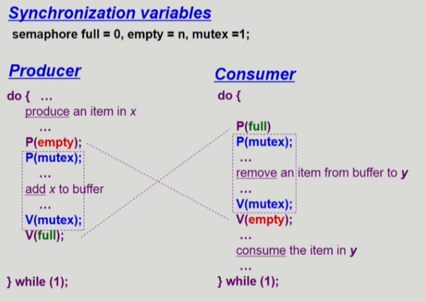
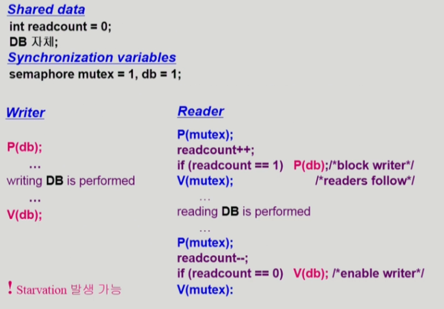
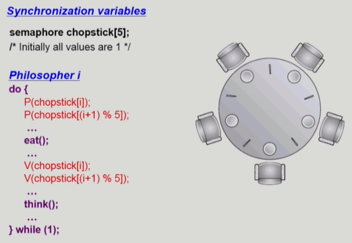
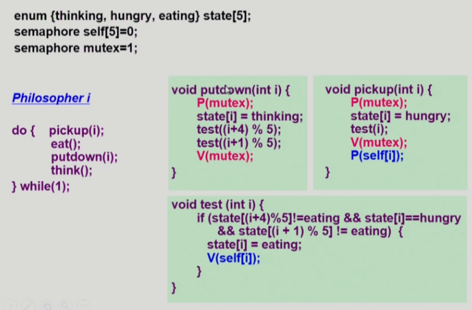

# [운영체제] Process Synchronization #2

## Semaphores



예를 들어 S = 5라고 하면 5번의 P 연산이 가능하고, 그 이후 V 연산을 수행해야 P 연산이 가능하다.




## Block / Wakeup Implementation

-  Semaphore를 아래와 같이 정의

```
typedef struct {
    int value; // semaphore
    struct process *L; // process wait queue
} semaphore;
```

- block과 wakeup을 다음과 같이 가정
- block: 커널은 block을 호출한 프로세스를 suspend시킴. 이 프로세스의 PCB를 semaphore에 대한 wait queue에 넣음.
- wakeup(P): block된 프로세스 P를 wakeup 시킴. 이 프로세스의 PCB를 ready queue로 옮김.

- Semaphore 연산이 이제 다음과 같이 정의됨



## Busy-wait vs Block/wakeup

- critical section의 길이가 긴 경우 block/wakeup이 적당
- critical section의 길이가 매우 짧은 경우 busy-wait이 적당
- 일반적으로 block/wakeup이 더 좋음

## Two Types of Semaphores

- Counting semaphore
    - 도메인이 0 이상인 임의의 정수값
    - 주로 resource counting에 사용
- Binary semaphore
    - 0 또는 1 값만 가질 수 있는 semaphore
    - 주로 mutual exclusion (lock/unlock)에 사용

## Deadlock and Starvation

- Deadlock
    - 둘 이상의 프로세스가 서로 상대방에 의해 충족될 수 있는 event를 무한히 기다리는 현상



-> 자원을 얻는 순서를 동일하게 하면 해결 가능. 위 예에서 P1 프로세스가 P1 프로세스와 같이 S, Q 자원을 순서대로 요구하면 해결 가능.

- Starvation
    - indefinite blocking. 프로세스가 suspend된 이유에 해당하는 semaphore queue에 빠져나갈 수 없는 현상

## Classical Problems of Synchronization

### Bounded-Buffer Problem (Producer-Consumer Problem)





- 문제점
    - Producer가 동일한 buffer에 접근해 조작하려 할 때 -> lock 걸어줘야 함
    - Consumer가 비어있는 buffer에서 Producer의 작업을 기다려야 할 때

- Shared data
buffer 자체 및 buffer 조작 변수 (empty/full buffer의 시작 위치)

- Synchronization variables
    - mutual exclusion: Need binary semaphore (shared data의 mutual exclusion을 위해)
    - resource count: Need integer semaphore (남은 empty/full buffer의 수 표시를 위해)

### Readers and Writers Problem



- 한 process가 DB에 write 중일 때 다른 process가 접근하면 안됨
- read는 동시에 여럿이 해도 됨
- solution
    - writer가 DB에 접근 허가를 아직 얻지 못한 상태에서는 모든 대기 중인 reader들을 다 DB에 접근하게 해준다.
    - writer는 대기 중인 reader가 하나도 없을 때 DB 접근이 허용된다
    - 일단 writer가 DB에 접근 중이면 reader들은 접근이 허용된다
    - wirter가 DB에 빠져나가야만 reader의 접근이 허용된다

- Shared data
    - DB 자체
    - readcount: 현재 DB에 접근 중인 reader의 수

- Synchronization variables
    - mutex: 공유 변수 readcount를 접근하는 코드(critical section)의 mutual exclusion을 보장하기 위해
    - db: reader와 writer가 공유 DB 자체를 올바르게 접근하게 하는 역할

### Dining-Philosophers Problem



- 문제점
    - Deadlock 가능성
    - 모든 철학자가 동시에 배가 고파져 왼쪽 젓가락을 집어버린 경우 -> 영원히 밥을 먹을 수 없음

- solution
    - 4명의 철학자만이 테이블에 동시에 앉을 수 있도록 한다
    - 젓가락을 두 개 모두 집을 수 있을 때에만 젓가락을 집을 수 있게 한다
    - 비대칭
        - 짝수(홀수) 철학자는 왼쪽(오른쪽) 젓가락부터 집도록 한다

