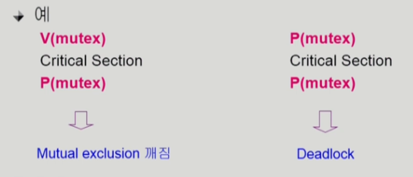
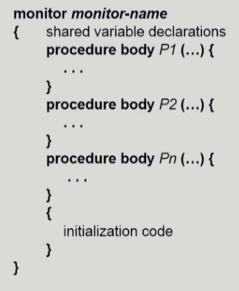
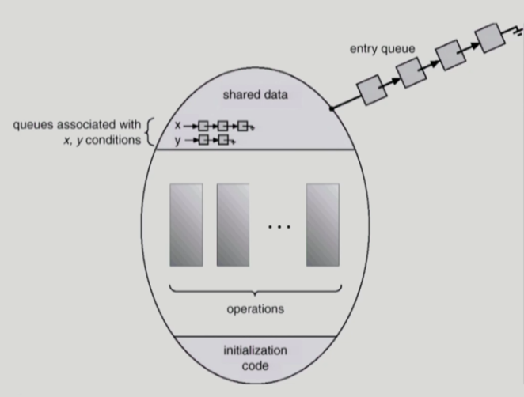

# [운영체제] Process Synchronization #3

## Monitor

- Semaphore의 문제점
    - 코딩하기 힘들다
    - 정확성의 입증이 어렵다
    - 자발적 협력이 필요하다
    - 한번의 실수가 모든 시스템에 치명적인 영향을 끼친다

- 동시 수행 중인 프로세스 사이에서 abstract data type의 안전한 공유를 보장하기 위한 high-level synchronization construct

- 모니터 내에서는 한번에 하나의 프로세스만이 활동 가능
- 프로그래머가 동기화 제약 조건을 명시적으로 코딩할 필요 없음
- 프로세스가 모니터 안에서 기다릴 수 있도록 하기 위해 condition variable 사용
- Condition variable은 `wait`와 `signal` 연산에 의해서만 접근 가능

- `x.wait();`: x.wait()을 invoke한 프로세스는 다른 프로세스가 x.signal()을 invoke하기 전까지 suspend된다
- `x.signal()`: x.signal()은 정확하게 하나의 suspend된 프로세스를 resume한다. Suspend된 프로세스가 없으면 아무 일도 일어나지 않는다

