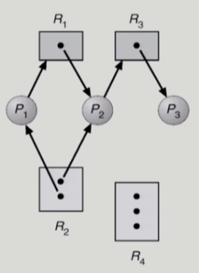
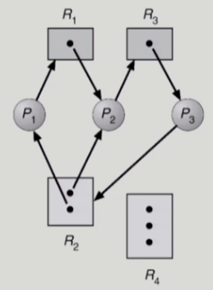
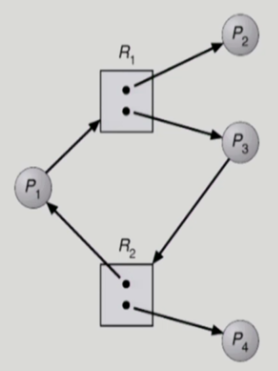
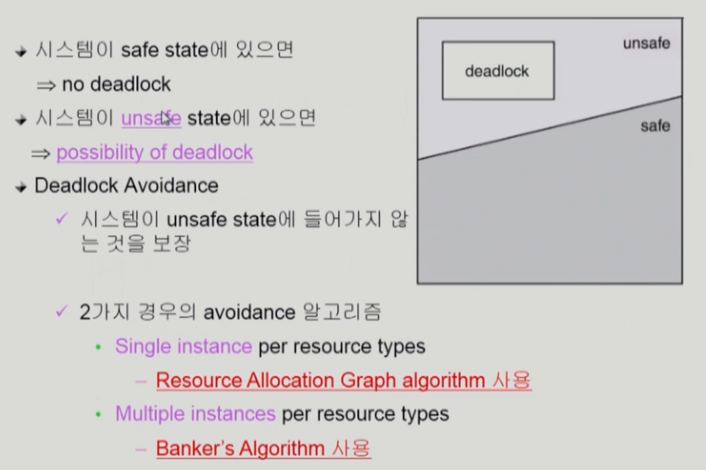
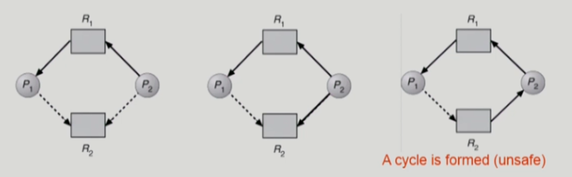
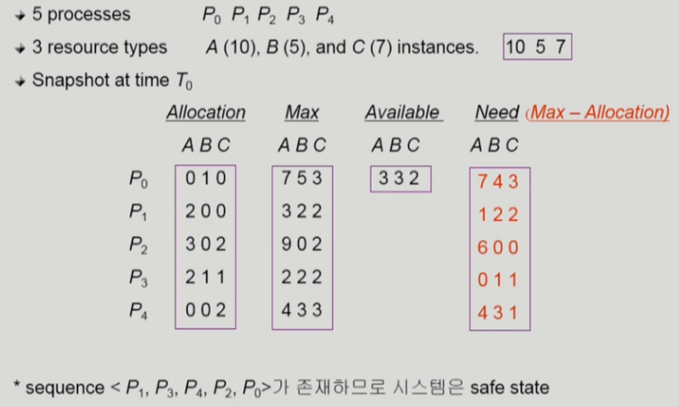
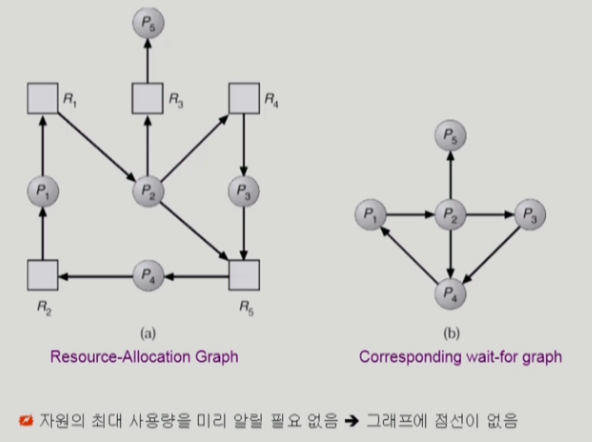
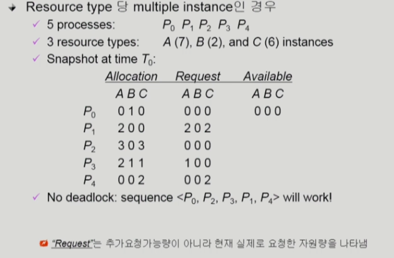

# [운영체제] Deadlock

## The Deadlock Problem

- Deadlock
    - 일련의 프로세스들이 서로가 가진 자원들 기다리며 block된 상태
- Resource
    - 하드웨어, 소프트웨어 등을 포함하는 개념
    - 예) I/O, CPU cycle, memory space, semaphore 등
    - 프로세스가 자원을 사용하는 절차
        - Request, Allocate, Use, Release
    - Deadlock Example
        - 시스템에 2개의 tape drive가 있다.
        - 프로세스 P1과 P2 각각 하나의 tape drive를 보유한 채 다른 하나를 기다리고 있다

## Deadlock 발생 조건 4가지

- Mutual exclusion
    - 매 순간 하나의 프로세스만이 자원을 사용할 수 있음
- No Preemption
    - 프로세스는 자원을 스스로 내어놓을 뿐 강제로 빼앗기지 않음
- Hold and wait
    - 자원을 가진 프로세스가 다른 자원을 기다릴 때, 보유 자원을 놓지 않고 계속 가지고 있음
- Cicular wait
    - 자원을 기다리는 프로세스간에 사이클이 형성되어야 함
        - P0는 P1이 가진 자원을 기다림
        - P1는 P2가 가진 자원을 기다림
        - P2는 p0가 가진 자원을 기다림

## Resource-Allocation Graph

- Vertex
    - Process P = {P1, P2, ..., Pn}
    - Resource R = {R1, R2, ..., Rn}

- Edge
    - request edge Pi -> Ri
    - assignment edge Ri -> Pi

- 그래프에 cycle이 없으면 deadlock이 아니다
- 그래프에 cycle이 있으면
    - 만약 자원 당 인스턴스가 하나 밖에 없으면 deadlock이 있다
    - 만약 자원 당 인스턴스가 여러 개 있으면 deadlock일 수도, 아닐 수도 있다.

- deadlock이 아닌 경우

- deadlock인 경우

- 그래프에 cycle이 있지만 deadlock이 아닌 경우

- R1 중 하나는 P2, R2 중 하나는 P4에 할당되어 있지만 반납을 하면 available한 상태로 바뀌고 그 때 P1, P3에게 할당하면 되므로 deadlock이 아니다

## Deadlock의 처리 방법

- Deadlock Prevention
    - 자원 할당 시 Deadlock의 4가지 필요 조건 중 어느 하나가 만족되지 않도록 하는 것

- Deadlock Avoidance
    - 자원 요청에 대한 부가적인 정보를 이용해서 deadlock의 가능성이 없는 경우에만 자원을 할당
    - 시스템 state가 원래 state로 돌아올 수 있는 경우에만 자원 할당

- Deadlock Detection and recovery
    - Deadlock 발생은 허용하되 그에 대한 detection 루틴을 두어 deadlock 발견 시 recover

- Deadlock ignorance
    - Deadlock을 시스템이 책임지지 않음
    - Unix를 포함한 대부분의 OS가 채택

## Deadlock Prevention

- Mutual Exclusion
    - 공유해서는 안되는 자원의 경우 반드시 성립해야 함

- Hold and Wait
    - 프로세스가 자원을 요청할 때 다른 어떤 자원도 가지고 있지 않아야 한다
    - 방법 1. 프로세스 시작 시 모든 필요한 자원을 할당받게 하는 방법
    - 방법 2. 자원이 필요할 경우 보유 자원을 모두 놓고 다시 요청

- No Preemption
    - 프로세스가 어떤 자원을 기다려야 하는 경우 이미 보유한 자원이 선점됨
    - 모든 필요한 자원을 얻을 수 있을 때 그 프로세스는 다시 시작된다
    - State를 쉽게 save하고 restore 할 수 있는 자원에서 주로 사용

- Circular Wait
    - 모든 자원 유형에 할당 순서를 정하여 정해진 순서대로만 자원 할당
    - 예를 들어 순서가 3인 자원 Ri를 보유 중인 프로세스가 순서가 1인 자원 Rj를 할당받기 위해서는 우선 Ri를 release 해야 한다.

## Deadlock Avoidance

- 자원 요청에 대한 부가정보를 이용해서 자원 할당이 deadlock으로 안전한지를 동적으로 조사해서 안전한 경우에나 할당
- 가장 단순하고 일반적인 모델은 프로세스들이 필요로 하는 각 자원별 최대 사용량을 미리 선언하도록 하는 방법

- safe state
    - 시스템 내의 프로세스들에 대한 safe sequence가 존재하는 상태

- safe sequence
    - 프로세스의 sequence <P1, P2, ..., Pn>이 safe하려면 Pi의 자원 요청이 `가용 자언 + 모든 Pj (j < i)의 보유 자원`에 의해 충족되어야 함
    - 조건을 만족하면 다음 방법으로 모든 프로세스의 수행을 보장
        - Pi의 자원 요청이 즉시 충족될 수 없으면 모든 Pj(j < i)가 종료될 때까지 기다린다
        - Pi-1이 종료되면 Pi의 자원 요청을 만족시켜 수행한다

### Resource Allocation Graph Algorithm

- Claim edge P1->Rj
    - 프로세스 Pi가 자원 Rj를 미래에 요청할 수 있음을 뜻함 (점선으로 표시)
    - 프로세스가 해당 자원 요쳥 시 request edge로 바뀜 (실선)
    - Rj가 release 되면 assignment edge는 다시 claim edge로 바뀐다

- request edge의 assignment edge 변경 시 (점선을 포함하여) cycle이 생기지 않는 경우에만 요청 자원을 할당한다

- Cycle 생성 여부 조사 시 프로세스의 수가 n일 때 O(n^2) 시간이 걸린다

### Banker's Algorithm

- 가정
    - 모든 프로세스는 자원의 최대 사용량을 미리 명시
    - 프로세스가 요청 자원을 모두 할당받은 경우 규한 시간 안에 이들 자원을 다시 반납한다

- 방법 
    - 기본 개념: 자원 요청 시 safe 상태를 유지할 경우에만 할당
    - 총 요청 자원의 수가 가용 자원의 수보다 적은 프로세스를 선택 (그런 프로세스가 없으면 unsafe 상태)
    - 그런 프로세스가 있으면 그 프로세스에게 자원을 할당
    - 할당 받은 프로세스가 종료되면 모든 자원을 반납
    - 모든 프로세스가 종료될 때까지 이러한 과정 반복

## Deadlock Detection and recovery

- Deadlock Detection
    - 자원 타입 당 single instance인 경우
        - 자원 할당 그래프에서 cycle이 곧 deadlock을 의미

    - 자원 타입 당 multiple instance인 경우
        - Banker's algorithm과 유사한 방법 활용

- Wait-for graph Algorithm
    - 자원 타입 당 single instance인 경우
    - Wait-for graph
        - 자원 할당 그래프의 변형
        - 프로세스만으로 node 구성
        - Pj가 가지고 있는 자원을 Pk가 기다리는 경우 Pk->Pj
    - Algorithm
        - Wait-for graph에 cycle이 존재하지는 지를 주기적으로 조사 (On^2)

- Recovery
    - Process termination
        - Abort all deadlocked processes
        - Abort one process at a time until the deadlock cycle is eliminated
    
    - Resource Preemption
        - 비용을 최소화할 희생양을 선정
        - safe state로 rollback하려 process를 restart
        - Starvation 문제
            - 동일한 프로세스가 계속해서 희생양으로 선정되는 경우
            - cost factor에 rollback 횟수도 같이 고려

## Deadlock Ignorance

- Deadlock이 일어나지 않는다고 생각하고 아무런 조치도 취하지 않음
    - Deadlock이 매우 드물게 발생하므로 deadlock에 대한 조치 자체가 더 큰 overhead일 수 있음
    - 만약, 시스템에 deadlock이 발생한 경우 시스템이 비정상적으로 작동하는 것을 사람이 느낀 후, 직접 프로세스를 죽이는 방법 등으로 대처
    - UNIX, Windows 등 대부분의 범용 OS가 이 방식을 채택