# [운영체제] 메모리 관리

## Logical vs Physical Address

- Logical address (=virtual address)
    - 프로세스마다 독립적으로 가지는 주소 공간
    - 각 프로세스마다 0번지부터 시작
    - CPU가 보는 주소는 logical address임

- Physical address
    - 메모리에 실제 올라가는 위치

- 주소 바인딩: 주소를 결정하는 것
    - Symbolic Address (int a = 1) -> Logical Address -> Physical Address

## Address Binding

- Complie time binding
    - 물리적 메모리 주소 (physical address)가 컴파일 시 알려짐
    - 시작 위치 변경 시 재컴파일
    - 컴파일러는 절대 코드 (absolute code) 생성

- Load time binding
    - Loader의 책임 하에 물리적 메모리 주소 부여
    - 컴파일러가 재배치 가능 코드 (relocatable code)를 생성한 경우 가능

- Execution time binding (=Run time binding)
    - 수행이 시작된 이후에도 프로세스의 메모리 상 위치를 옮길 수 있음
    - CPU가 주소를 참조할 때마다 binding을 점검 (address mapping table)
    - 하드웨어적인 지원이 필요 (MMU)

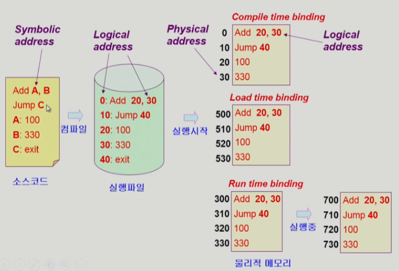

## Memory-Management Unit (MMU)

- logical address를 physical address로 매핑해주는 hardware device

- MMU scheme
    - base register (=relocation register): 접근할 수 있는 physical address의 최소값. 사용자 프로세스가 CPU에서 수행되며 생성해내는 모든 주소값에 대해 base register (=relocation register)의 값을 더한다
    - limit register: logical address의 범위. 프로세스의 최대 logical address의 위치를 저장한다
    
- user program
    - logical address만을 다룬다
    - 실제 physical address를 볼 수 없으며 알 필요가 없다 (CPU는 logical address를 바라보기 때문)

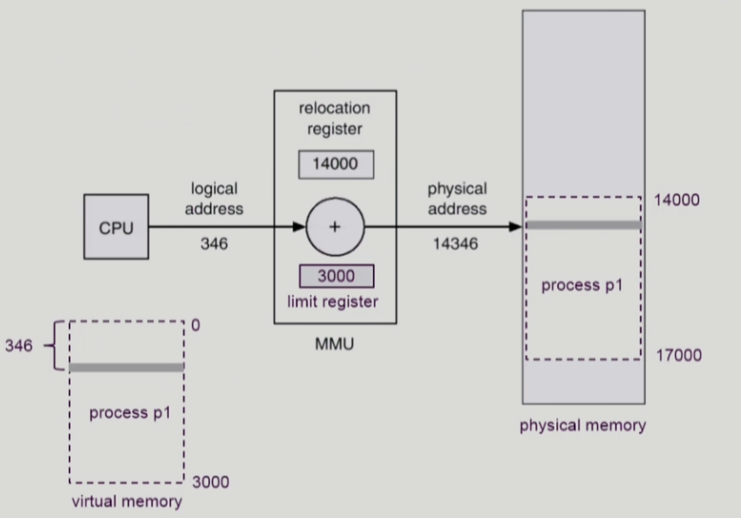

## Dynamic Loading

- 프로세스 전체를 메모리에 미리 다 올리는 것이 아니라 해당 루틴이 불려질 때 메모리에 load하는 것
- memory utilization의 향상
- 가끔씩 사용되는 많은 양의 코드의 경우 유용
- 운영체제의 특별한 지원 없이 프로그램 자체에서 구현 가능 (OS는 라이브러리를 통해 지원 가능)

## Overlays

- 메모리에 프로세스의 부분 중 실제 필요한 정보만을 올림
- 프로세스의 크기가 메모리보다 클 때 유용
- 운영체제의 지원 없이 사용자에 의해 구현
- 작은 공간의 메모리를 사용하던 초창기 시스템에서 수작업으로 프로그래머가 구현

## Swapping

- 프로세스를 일시적으로 메모리에서 backing store에 쫓아내는 것

- Backing store (=swap area)
    - 디스크
        - 많은 사용자의 프로세스 이미지를 담을 만큼 충분히 빠르고 큰 저장 공간

- Swap in / Swap out
    - 일반적으로 중기 스케줄러(swapper)에 의해 swap out 시킬 프로세스 선정
    - priority-based CPU scheduling algorithm
        - priority가 낮은 프로세스를 swapped out 시킴
        - priority가 높은 프로세스를 메모리에 올려 놓음
    - Compile time 혹은 load time binding에서는 원래 메모리 위치로 swap in 해야 함
    - Execution time binding에서는 추후 빈 메모리 영역 아무 곳에나 올릴 수 있음
    - Swap time은 대부분 transfer time임 (swap되는 양에 비례하는 시간)

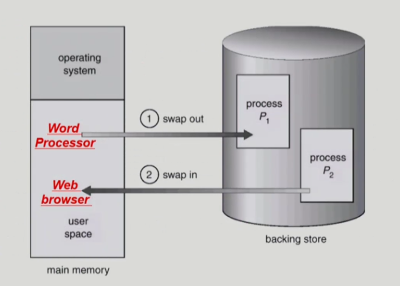

## Dynamic Linking

- Link: 여러 컴파일 된 파일을 하나로 묶어 실행 파일로 만드는 작업

- Linking을 실행 시간(execution time)까지 미루는 기법

- Static linking
    - 라이브러리가 프로그램의 실행 파일 코드에 포함됨
    - 실행 파일의 크기가 커짐
    - 동일한 라이브러리를 각각의 프로세스가 메모리에 올리므로 메모리 낭비

- Dynamic linking
    - 라이브러리가 실행 시 연결(link)됨
    - 라이브러리 호출 부분에 라이브러리 루틴의 위치를 찾기 위한 stub이라는 작은 코드를 둠
    - 라이브러리가 이미 메모리에 있으면 그 루틴의 주소로 가고 없으면 디스크에서 읽어옴
    - 운영체제의 도움이 필요

## Allocation of Physical Memory

- 메모리는 일반적으로 두 영역으로 나뉘어 사용
    - OS 상주 영역
        - interrupt vector와 함께 낮은 주소 영역 사용
    - 사용자 프로세스 영역
        - 높은 주소 영역 사용

- 사용자 프로세스 영역 할당 방법
    - Contiguous allocation
        - 각각의 프로세스가 메모리의 연속적인 공간에 적재되도록 하는 것
        - Fixed partition allocation
        - Variable partition allocation
    - Noncontiguous allocation
        - 하나의 프로세스가 메모리의 여러 영역에 분산되어 올라갈 수 있음
        - Paging
        - Segmentation
        - Paged Segmentation

## Contiguous Allocation

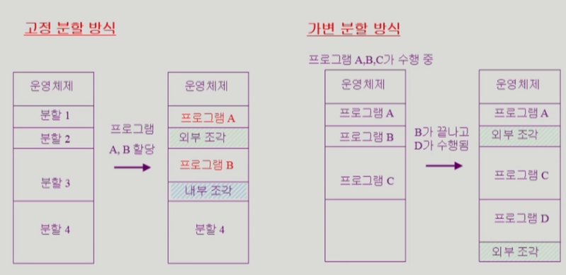

- 고정분할(Fixed partition) 방식
    - 물리적 메모리를 몇 개의 영구적 분할로 나눔
    - 분할의 크기가 모두 동일한 방식과 서로 다른 방식이 존재
    - 분할 당 하나의 프로그램 적재
    - 융통성이 없음
        - 동시에 메모리에 load되는 프로그램의 수가 고정됨
        - 최대 수행 가능 프로그램 크기 제한
    - Internal fragmentation 발생 (external fragmentation도 발생)

- 가변분할(Variable partition) 방식
    - 프로그램의 크기를 고려해서 할당
    - 분할의 크기, 개수가 동적으로 변함
    - 기술적 관리 기법 필요
    - External fragmentation 발생

- Hole
    - 가용 메모리 공간
    - 다양한 크기의 hole들이 메모리 여러 곳에 흩어져 있음
    - 프로세스가 도착하면 수용 가능한 hole을 할당
    - 운영체제는 다음의 정보를 유지
        - 1. 할당 공간
        - 2. 가용 공간 (hole)

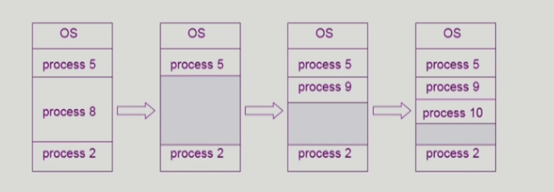

### Dynamic Storage-Allocation Problem

- 가변 분할 방식에서 size n인 요청을 만족하는 가장 적절한 hole을 찾는 문제

- First-fit
    - Size가 n 이상인 것 중 최초로 찾아지는 hole에 할당

- Best-fit
    - Size가 n 이상인 가장 작은 hole을 찾아서 할당
    - Hole들의 리스크가 크기 순으로 정렬되지 않는 경우 모든 hole의 리스트를 탐색해야함
    - 많은 수의 아주 작은 hole들이 생성됨

- Worst-fit
    - 가장 큰 hole에 할당
    - 역시 모든 리스트를 탐색해야 함
    - 상대적으로 아주 큰 hole들이 생성됨

- First-fit과 best-fit이 worst-fit보다 속도와 공간 이용률 측면에서 효과적

### Compaction

- External fragmentation 문제를 해결하는 한 가지 방법
- 사용 중인 메모리 영역을 한 군데로 몰고 hole들을 다른 한 곳으로 몰아 큰 block을 만드는 것
- 매우 비용이 많이 드는 작업
- 최소한의 메모리 이동으로 compaction하는 방법 (매우 복잡한 문제)
- Compaction은 프로세스의 주소가 실행 시간에 동적으로 재배치가 가능한 경우에만 수행 가능

## Noncontiguous allocation

### Paging

- 프로세스의 가상 메로리를 동일한 사이즈의 page 단위로 나눔
- 가상 메모리의 내용이 page 단위로 noncontiguous하게 저장됨
- 일부는 backing storage에, 일부는 physical memory에 저장

- Basic Method
    - physical memory를 동일한 크기의 frame으로 나눔
    - logical memory를 동일 크기의 page로 나눔 (frame과 같은 크기)
    - 모든 가용 frame들을 관리
    - page table을 사용하여 logical address를 physical address로 변환
    - External fragmentation 발생 안함
    - Internal fragmentation 발생 가능

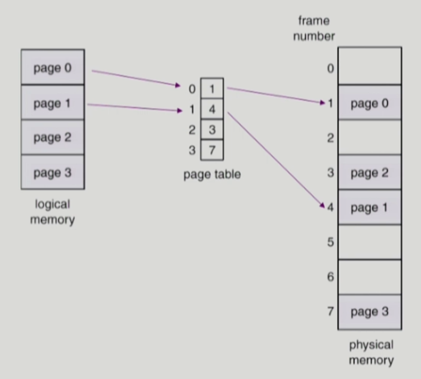

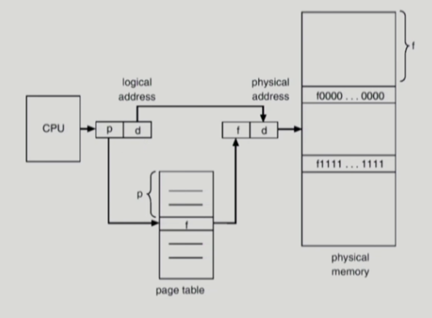

## Implementation of Page Table

- Page table은 main memory에 상주
- Page-table base register (PTBR)가 page table을 가리킴
- Page-table length register (PTLR)가 테이블 크기를 보관
- 모든 메모리 접근 연산에는 2번의 memory access 필요
- Page table 접근 1번, 실제 data/instruction 접근 1번
- 속도 향상을 위해 associative register 혹은 translation look-aside buffer (TLB)라 불리는 고속의 lookup hardware cache 사용

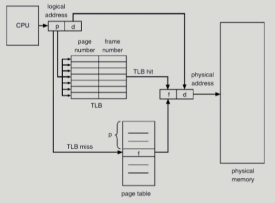

## Associative register

- parallel search가 가능
    - TLB에는 page table 중 일부만 존재

- Address translation
    - page table 중 일부가 associative register에 보관되어 있음
    - 만약 해당 page #가 associative register에 있는 경우 곧바로 frame #을 얻음
    - 그렇지 않은 경우 main memory에 있는 page table로부터 frame #을 얻음
    - TLB는 context switch 때 flush (remove old entries)

## Effective Access Time

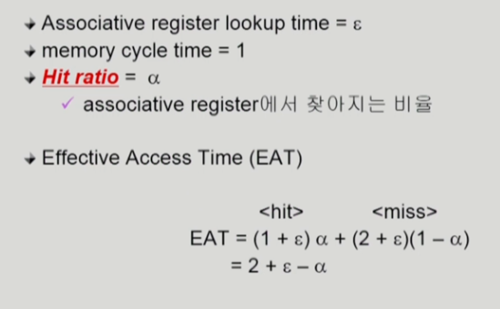

## Two-Level Page Table

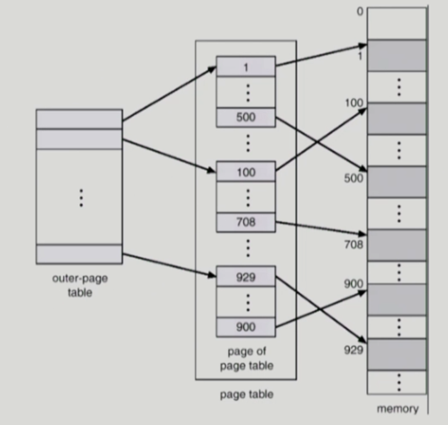

- 현대의 컴퓨터는 address space가 매우 큰 프로그램 지원
    - 32 bit address 사용 시: 2^32 (4G)의 주소 공간
        - page size가 4K 시 1M개의 page table entry 필요
        - 각 page entry가 4B시 프로세스당 4M의 page table 필요
        - 그러나 대부분의 프로그램은 4G의 주소 공간 중 지극히 일부분만 사용하므로 page talbe 공간이 심하게 낭비됨
    - page table 자체를 page로 구성
    - 사용되지 않는 주소 공간에 대한 outer page table의 entry 값은 null (대응하는 inner page table이 없음)

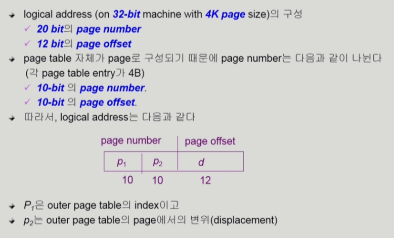

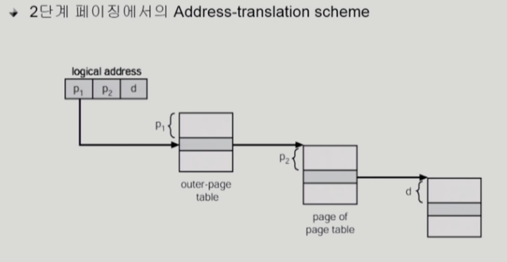

## Multilevel Paging and Performance

- Address space가 더 커지면 다단계 페이지 테이블이 필요
- 각 단계의 페이지 테이블이 메모리에 존재하므로 logical address의 physical address 변환에 더 많은 메모리 접근 필요
- TLB를 통해 메모리 접근 시간을 줄일 수 있음
- 4단계 페이지 테이블을 사용하는 경우
    - 메모리 접근 시간이 100ns, TLB 접근 시간이 20ns이고
    - TLB hit ratio가 98%인 경우
        - effective memory access time = 0.98 * 120 + 0.02 * 520 = 128ns
        - 결과적으로 주소 변환을 위해 28ns만 소요

## Valid / Invalid Bit in a Page Table

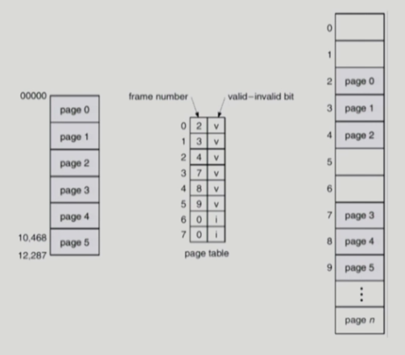

- Page table의 각 entry 마다 아래의 bit를 둔다
    - Protection bit
        - page에 대한 접근 권한 (read / write / read-only)
    - Valid-Invalid bit
        - valid는 해당 주소의 frame에 그 프로세스를 구성하는 유효한 내용이 있음을 뜻함
        - invalid는 해당 주소의 frame에 유효한 내용이 없음을 뜻함
            - 프로세스가 그 주소 부분을 사용하지 않는 경우
            - 해당 페이지가 메모리에 올라와 있지 않고 swap area에 있는 경우

## Inverted Page Table

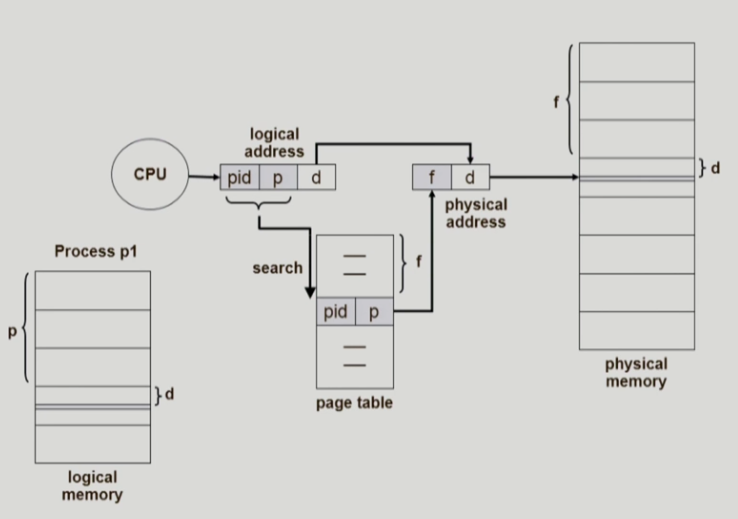

- page table이 매우 큰 이유
    - 모든 프로세스 별로 그 logical address에 대응하는 모든 page에 대해 page table entry가 존재
    - 대응하는 page가 메모리에 있든 아니든 간에 page table에는 entry로 존재

- Inverted page table
    - Page frame 하나 당 page table에 하나의 entry를 둔 것
    - 각 page table entry는 각각의 물리적 메모리의 page frame이 담고 있는 내용 표시 (process-id, process의 logical address)
    - 단점: 테이블 전체를 탐색해야 함 -> associative register 사용하여 해결 (expensive)

## Shared Page

- Shared code
    - Re-entrant Code (=Pure code)
    - read-only하여 프로세스 간에 하나의 code만 메모리에 올림 (eg, text editors, compilers, window systems)
    - Shared code는 모든 프로세스의 logical address space에서 동일한 위치에 있어야 함
- Private code and data
    - 각 프로세스들은 독자적으로 메모리에 올림
    - Private data는 logical address space의 아무 곳에 와도 무방

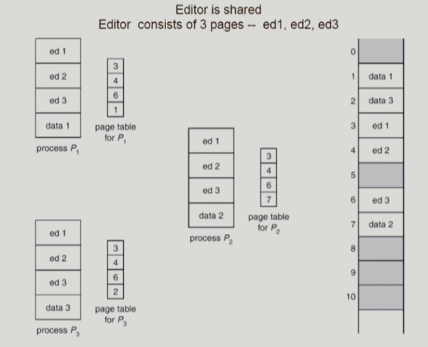

