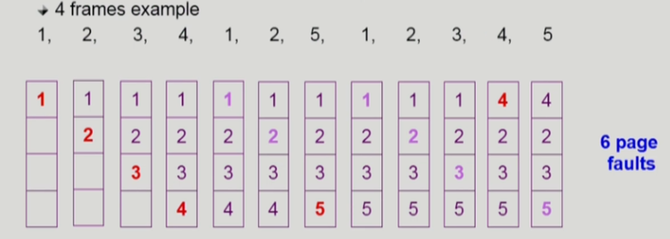
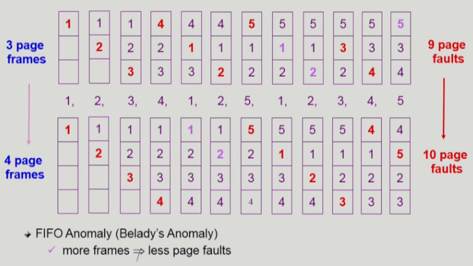
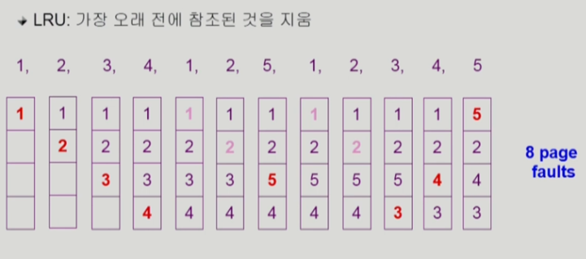
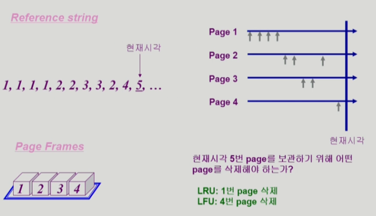
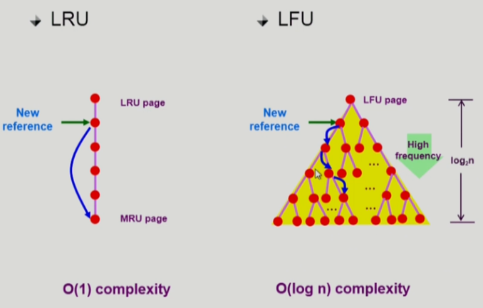

# [운영체제] 가상 메모리

## Demand Paging

- 실제로 필요할 때 page를 메모리에 올리는 것
    - I/O 양의 감소
    - 메모리 사용량 감소
    - 빠른 응답 시간
    - 더 많은 사용자 수용

- Valid / Invalid bit 사용
    - Invalid의 의미
        - 사용되지 않는 주소 영역인 경우
        - 페이지가 물리적 메모리에 없는 경우
    - 처음에는 모든 page entry가 invalid로 초기화
    - address translation 시에 invalid bit이 set되어 있으면 -> page fault

## Page Fault

- invalid page를 접근하면 MMU가 trap을 발생시킴
- Kernel mode로 들어가서 page fault handler가 invoke됨
- 다음과 같은 순서로 page fault를 처리한다
    1. Invalid reference? (eg. bad address, protection violation) => abort process
    2. Get an empty page frame (없으면 뺏어온다: replace)
    3. 해당 페이지를 disk에서 memory로 읽어온다
        1. Disk I/O가 끝나기까지 이 프로세스는 CPU를 preempt 당함 (block)
        2. Disk read가 끝나면 page tables entry 기록, valid/invalid bit = "valid"
        3. Ready queue에 프로세스를 insert -> dispatch later
    4. 이 프로세스가 CPU를 잡고 다시 running
    5. 아까 중단되었던 instruction을 재개

## Performance of Demand Paging

- 대부분은 page fault가 안나지만 한 번 나면 엄청난 시간이 소요됨

## Free frame이 없는 경우

- Page replacement
    - 어떤 frame을 빼앗아올지 결정해야 함
    - 곧바로 사용되지 않을 page를 쫓아내는 것이 좋음
    - 동일한 페이지가 여러 번 메모리에서 쫓겨났다가 다시 들어올 수 있음

- Replacement Algorithm
    - Page fault rate를 최소화하는 것이 목표
    - 알고리즘의 평가
        - 주어진 page reference string에 대해 page fault를 얼마나 내는지 조사
    - reference string의 예
        - 1, 2, 3, 4, 1, 2, 5, 1, 2, 3, 4, 5

## Optimal Algorithm

- MIN (OPT): 가장 먼 미래에 참조되는 page를 replace

- 미래의 참조를 어떻게 아는가?
    - Offline algorithm
- 다른 알고리즘의 성능에 대한 upper bound 제공
    - Belady's optimal algorithm, MIN, OPT 등으로 불림

## FIFO (First In First Out) Algorithm

## LRU (Least Recently Used) Algorithm

## LFU (Least Frequently Used) Algorithm

- LFU: 참조 쵯수가 가장 적은 페이지를 지움
    - 최저 참조 횟수인 page가 여럿 있는 경우
        - LFU 알고리즘 자체에는 여러 page 중 임의로 선정
        - 성능 향상을 위해 가장 오래 전에 참조된 page를 지우게 구현할 수도 있따
    - 장단점
        - LRU처럼 직전 참조 시점만 보는 것이 아니라 장기적인 시간 규모를 보기 때문에 apge의 인기도를 좀 더 정확히 반영할 수 있음
        - 참조 시점의 최근성을 반영하지 못함
        - LRU보다 구현이 복잡함

## LRU와 LFU 알고리즘의 구현

