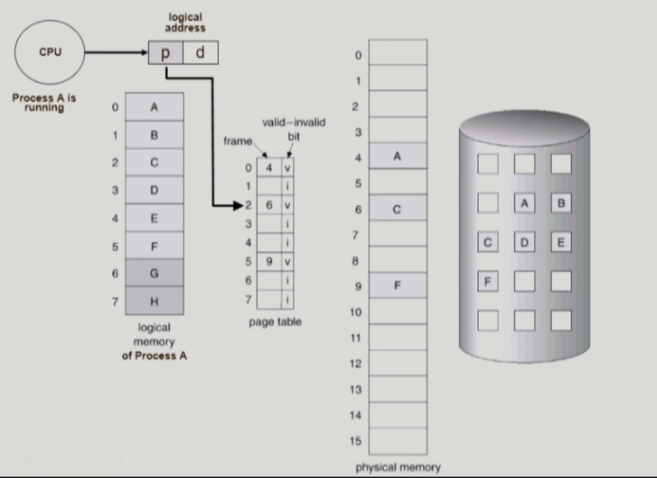
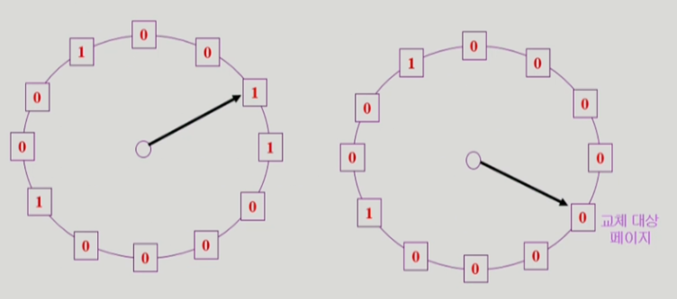

# [운영체제] 가상 메모리 #2

## 다양한 캐슁 환경

- 캐슁 기법
    - 한정된 빠른 공간에 요청된 데이터를 저장해 두었다가 후속 요청 시 캐쉬로부터 직접 서비스하는 방식
    - paging system 외에도 cache memory, buffer caching, web caching 등 다양한 분야에서 사용
- 캐쉬 운영의 시간 제약
    - 교체 알고리즘에서 삭제할 항목을 결정하는 일에 지나치게 많은 시간이 걸리는 경우 실제 시스템에서 사용할 수 없음
    - Buffer caching이나 web caching의 경우
        - O(1)에서 O(logn) 정도까지 허용
    - Paging system인 경우
        - page fault인 경우에만 OS가 관여함
        - 페이지가 이미 메모리에 존재하는 경우 참조 시각 등의 정보를 OS가 알 수 없음
        - O(1)인 LRU의 list 조작조차 불가능

## Paging System에서 LRU, LFU가 가능한가?

- OS는 가장 최근에, 가장 적게 참조된 메모리를 알 수 없다.

- Paging System에서 LRU, LFU가 불가능

## Clock Algorithm

- Paging system에서 일반적으로 사용되는 알고리즘
- LRU의 근사 알고리즘
- 여러 명칭으로 불림
    - Second chance algorithm
    - NRU (Not Used Recently) 또는 NRU(Not Recently Used)
- Reference bit을 사용해서 교체 대상 페이지 선정 (circular list)
- Reference bitrk 0인 것을 찾을 때까지 포인터를 하나씩 앞으로 이동
- 포인터 이동하는 중에 reference bit 1은 모두 0으로 바꿈
- Reference bit이 0인 것을 찾으면 그 페이지를 교체
- 한 바퀴 되돌아와서도 0이면 그 땐 replace 당함
- 자주 사용되는 페이지라면 second chance가 올 때 1

- Clock algorithm의 개선
    - reference bit과 modified bit (dirty bit)을 함께 사용
    - reference bit = 1: 최근에 참조된 페이지
    - modified bit = 1: 최근에 변경된 페이지 (I/O를 동반하는 페이지), modified bit가 1인 페이지를 쫓아낼 땐, disk에 새로 써줘야하고, 0일 땐, dist에 써줄 필요 없이 쫓아내기만 하면 됨

