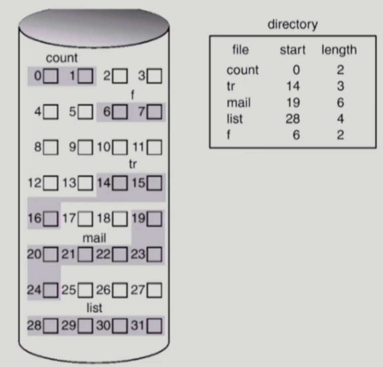
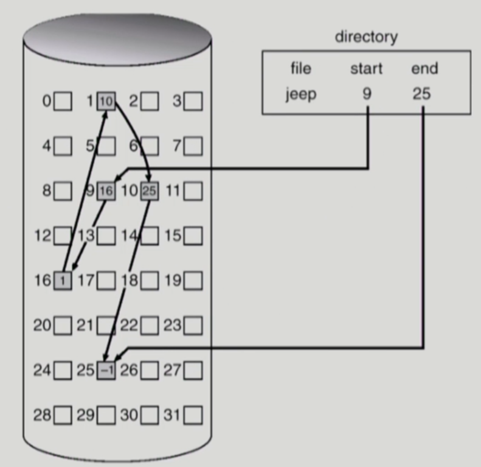
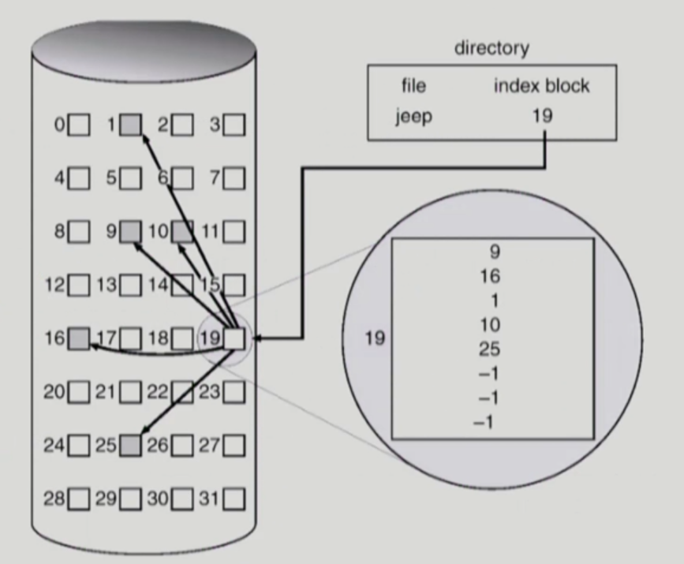

# [운영체제] 파일 시스템 구현

## Allocation of File Data in Disk

- Contiguous Allocation

- Linked Allocation

- Indexed Allocation

## Contiguous Allocation

- 단점
    - External fragmentation
    - File grow가 어려움
        - file 생성 시 얼마나 큰 hole을 배당할 것인가?
        - grow 가능 vs 낭비 (internal fragmentation)

- 장점
    - Fast I/O
        - 한번의 seek/rotation으로 많은 바이트 transfer
        - Realtime file 용으로 또는 이미 run 중이던 프로세스의 swapping용
    - Direct access(=random access) 가능

## Linked Allocation

- 장점
    - External fragmentation이 발생하지 않음

- 단점
    - Direct access가 불가능
    - Reliability 문제 
        - 한 sector가 고장나 pointer가 유실되면 많은 부분을 잃음
    - Pointer를 위한 공간이 block의 일부가 되어 공간 효율성을 떨어뜨림
        - 512 bytes/sector, 4 bytes/pointer

- 변형
    - File-allocation table (FAT) 파일 시스템
        - 포인터를 별도의 위치에 보관하여 reliability와 공간 효율성 문제를 해결

## Indexed Allocation

- 장점
    - External fragmentation이 발생하지 않음
    - Direct access 가능

- 단점
    - Small file의 경우 농간 낭비 (실제로 많은 파일들이 small)
    - Too large file의 경우 하나의 block으로 index를 저장하기에 부족
        - 해결 방안
            - 1. Linked Scheme
            - 2. Multi-level Index