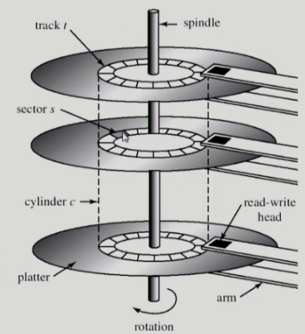

# [운영체제] 디스크 관리

## Disk Structure

- logical block
    - 디스크의 외부에서 보는 디스크의 다우니 정보 저장 공간
    - 주소를 가진 1차원 배열처럼 취급
    - 정보를 전송하는 최소 단위

- sector
    - logical block이 물리적인 디스크에 매핑된 위치
    - sector 0는 최외각 실린더의 첫 트랙에 있는 첫 번째 섹터이다

## Disk Scheduling

- Access time의 구성
    - Seek time
        - 헤드를 해당 실린더로 움직이는데 걸리는 시간
    
    - Rotational latency
        - 헤드가 원하는 섹터에 도달하기까지 걸리는 회전지연시간

    - Transfer time
        - 실제 데이터의 전송 시간

- Disk bandwidth
    - 단위 시간 당 전송된 바이트의 수

- Disk scheduling
    - seek time을 최소화하는 것이 목표
    - seek time 이 곧 seek distance

## Disk Management

- Physical formatting (Low-level formatting)
    - 디스크를 컨트롤러가 읽고 쓸 수 있도록 섹터들로 나누는 과정
    - 각 섹터는 header + 실제 data (보통 512 bytes) + trailer로 구성
    - header와 trailer는 sector number, ECC (Error-Correction Code) 등의 정보가 저장되며 컨트롤러가 직접 접근 및 운영

- Partitioning
    - 디스크를 하나 이상의 실린더 그룹으로 나누는 과정
    - OS는 이것을 독립적 disk로 취급 (logical disk)

- Logical formatting
    - 파일 시스템을 만드는 것
    - FAT, inode, free space 등의 구조 포함

- Booting
    - ROM에 있는 samll bootstrap loader의 실행
    - sector 0 (boot block)을 load하여 실행
    - sector 0은 full bootstrap loader program
    - OS를 디스크에서 load하여 실행